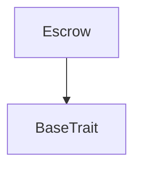
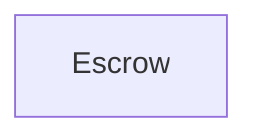

# Tact compilation report
Contract: Escrow
BoC Size: 1304 bytes

## Structures (Structs and Messages)
Total structures: 31

### DataSize
TL-B: `_ cells:int257 bits:int257 refs:int257 = DataSize`
Signature: `DataSize{cells:int257,bits:int257,refs:int257}`

### StateInit
TL-B: `_ code:^cell data:^cell = StateInit`
Signature: `StateInit{code:^cell,data:^cell}`

### Context
TL-B: `_ bounceable:bool sender:address value:int257 raw:^slice = Context`
Signature: `Context{bounceable:bool,sender:address,value:int257,raw:^slice}`

### SendParameters
TL-B: `_ mode:int257 body:Maybe ^cell code:Maybe ^cell data:Maybe ^cell value:int257 to:address bounce:bool = SendParameters`
Signature: `SendParameters{mode:int257,body:Maybe ^cell,code:Maybe ^cell,data:Maybe ^cell,value:int257,to:address,bounce:bool}`

### MessageParameters
TL-B: `_ mode:int257 body:Maybe ^cell value:int257 to:address bounce:bool = MessageParameters`
Signature: `MessageParameters{mode:int257,body:Maybe ^cell,value:int257,to:address,bounce:bool}`

### DeployParameters
TL-B: `_ mode:int257 body:Maybe ^cell value:int257 bounce:bool init:StateInit{code:^cell,data:^cell} = DeployParameters`
Signature: `DeployParameters{mode:int257,body:Maybe ^cell,value:int257,bounce:bool,init:StateInit{code:^cell,data:^cell}}`

### StdAddress
TL-B: `_ workchain:int8 address:uint256 = StdAddress`
Signature: `StdAddress{workchain:int8,address:uint256}`

### VarAddress
TL-B: `_ workchain:int32 address:^slice = VarAddress`
Signature: `VarAddress{workchain:int32,address:^slice}`

### BasechainAddress
TL-B: `_ hash:Maybe int257 = BasechainAddress`
Signature: `BasechainAddress{hash:Maybe int257}`

### JettonData
TL-B: `_ totalSupply:int257 mintable:bool owner:address content:^cell jettonWalletCode:^cell = JettonData`
Signature: `JettonData{totalSupply:int257,mintable:bool,owner:address,content:^cell,jettonWalletCode:^cell}`

### JettonWalletData
TL-B: `_ balance:int257 owner:address master:address code:^cell = JettonWalletData`
Signature: `JettonWalletData{balance:int257,owner:address,master:address,code:^cell}`

### MaybeAddress
TL-B: `_ address:Maybe address = MaybeAddress`
Signature: `MaybeAddress{address:Maybe address}`

### JettonUpdateContent
TL-B: `jetton_update_content#00000004 queryId:uint64 content:^cell = JettonUpdateContent`
Signature: `JettonUpdateContent{queryId:uint64,content:^cell}`

### JettonTransfer
TL-B: `jetton_transfer#0f8a7ea5 queryId:uint64 amount:coins destination:address responseDestination:Maybe address customPayload:Maybe ^cell forwardTonAmount:coins forwardPayload:remainder<slice> = JettonTransfer`
Signature: `JettonTransfer{queryId:uint64,amount:coins,destination:address,responseDestination:Maybe address,customPayload:Maybe ^cell,forwardTonAmount:coins,forwardPayload:remainder<slice>}`

### JettonTransferInternal
TL-B: `jetton_transfer_internal#178d4519 queryId:uint64 amount:coins sender:address responseDestination:Maybe address forwardTonAmount:coins forwardPayload:remainder<slice> = JettonTransferInternal`
Signature: `JettonTransferInternal{queryId:uint64,amount:coins,sender:address,responseDestination:Maybe address,forwardTonAmount:coins,forwardPayload:remainder<slice>}`

### JettonNotification
TL-B: `jetton_notification#7362d09c queryId:uint64 amount:coins sender:address forwardPayload:remainder<slice> = JettonNotification`
Signature: `JettonNotification{queryId:uint64,amount:coins,sender:address,forwardPayload:remainder<slice>}`

### JettonBurn
TL-B: `jetton_burn#595f07bc queryId:uint64 amount:coins responseDestination:address customPayload:Maybe ^cell = JettonBurn`
Signature: `JettonBurn{queryId:uint64,amount:coins,responseDestination:address,customPayload:Maybe ^cell}`

### JettonBurnNotification
TL-B: `jetton_burn_notification#7bdd97de queryId:uint64 amount:coins sender:address responseDestination:address = JettonBurnNotification`
Signature: `JettonBurnNotification{queryId:uint64,amount:coins,sender:address,responseDestination:address}`

### JettonExcesses
TL-B: `jetton_excesses#d53276db queryId:uint64 = JettonExcesses`
Signature: `JettonExcesses{queryId:uint64}`

### ProvideWalletAddress
TL-B: `provide_wallet_address#2c76b973 queryId:uint64 ownerAddress:address includeAddress:bool = ProvideWalletAddress`
Signature: `ProvideWalletAddress{queryId:uint64,ownerAddress:address,includeAddress:bool}`

### TakeWalletAddress
TL-B: `take_wallet_address#d1735400 queryId:uint64 walletAddress:address ownerAddress:Maybe ^cell = TakeWalletAddress`
Signature: `TakeWalletAddress{queryId:uint64,walletAddress:address,ownerAddress:Maybe ^cell}`

### Mint
TL-B: `mint#00000015 queryId:uint64 receiver:address tonAmount:coins mintMessage:JettonTransferInternal{queryId:uint64,amount:coins,sender:address,responseDestination:Maybe address,forwardTonAmount:coins,forwardPayload:remainder<slice>} = Mint`
Signature: `Mint{queryId:uint64,receiver:address,tonAmount:coins,mintMessage:JettonTransferInternal{queryId:uint64,amount:coins,sender:address,responseDestination:Maybe address,forwardTonAmount:coins,forwardPayload:remainder<slice>}}`

### ChangeOwner
TL-B: `change_owner#00000003 queryId:uint64 newOwner:address = ChangeOwner`
Signature: `ChangeOwner{queryId:uint64,newOwner:address}`

### UpdateJettonWalletCode
TL-B: `update_jetton_wallet_code#9eacde91 newJettonWalletCode:^cell = UpdateJettonWalletCode`
Signature: `UpdateJettonWalletCode{newJettonWalletCode:^cell}`

### TakeEscrowData
TL-B: `take_escrow_data#2c394a7e escrowData:EscrowData{id:uint32,sellerAddress:address,guarantorAddress:address,dealAmount:coins,guarantorRoyaltyPercent:uint32,isFunded:bool,assetAddress:Maybe address,jettonWalletCode:Maybe ^cell,buyerAddress:Maybe address} = TakeEscrowData`
Signature: `TakeEscrowData{escrowData:EscrowData{id:uint32,sellerAddress:address,guarantorAddress:address,dealAmount:coins,guarantorRoyaltyPercent:uint32,isFunded:bool,assetAddress:Maybe address,jettonWalletCode:Maybe ^cell,buyerAddress:Maybe address}}`

### Funding
TL-B: `funding#9451eca9  = Funding`
Signature: `Funding{}`

### Approve
TL-B: `approve#e8c15681  = Approve`
Signature: `Approve{}`

### Cancel
TL-B: `cancel#cc0f2526  = Cancel`
Signature: `Cancel{}`

### ProvideEscrowData
TL-B: `provide_escrow_data#c33b3126  = ProvideEscrowData`
Signature: `ProvideEscrowData{}`

### EscrowData
TL-B: `_ id:uint32 sellerAddress:address guarantorAddress:address dealAmount:coins guarantorRoyaltyPercent:uint32 isFunded:bool assetAddress:Maybe address jettonWalletCode:Maybe ^cell buyerAddress:Maybe address = EscrowData`
Signature: `EscrowData{id:uint32,sellerAddress:address,guarantorAddress:address,dealAmount:coins,guarantorRoyaltyPercent:uint32,isFunded:bool,assetAddress:Maybe address,jettonWalletCode:Maybe ^cell,buyerAddress:Maybe address}`

### Escrow$Data
TL-B: `_ id:uint32 sellerAddress:address guarantorAddress:address buyerAddress:Maybe address dealAmount:coins guarantorRoyaltyPercent:uint32 isFunded:bool assetAddress:Maybe address jettonWalletCode:Maybe ^cell = Escrow`
Signature: `Escrow{id:uint32,sellerAddress:address,guarantorAddress:address,buyerAddress:Maybe address,dealAmount:coins,guarantorRoyaltyPercent:uint32,isFunded:bool,assetAddress:Maybe address,jettonWalletCode:Maybe ^cell}`

## Get methods
Total get methods: 3

## calculateRoyaltyAmount
No arguments

## walletAddress
No arguments

## escrowInfo
No arguments

## Exit codes
* 2: Stack underflow
* 3: Stack overflow
* 4: Integer overflow
* 5: Integer out of expected range
* 6: Invalid opcode
* 7: Type check error
* 8: Cell overflow
* 9: Cell underflow
* 10: Dictionary error
* 11: 'Unknown' error
* 12: Fatal error
* 13: Out of gas error
* 14: Virtualization error
* 32: Action list is invalid
* 33: Action list is too long
* 34: Action is invalid or not supported
* 35: Invalid source address in outbound message
* 36: Invalid destination address in outbound message
* 37: Not enough Toncoin
* 38: Not enough extra currencies
* 39: Outbound message does not fit into a cell after rewriting
* 40: Cannot process a message
* 41: Library reference is null
* 42: Library change action error
* 43: Exceeded maximum number of cells in the library or the maximum depth of the Merkle tree
* 50: Account state size exceeded limits
* 128: Null reference exception
* 129: Invalid serialization prefix
* 130: Invalid incoming message
* 131: Constraints error
* 132: Access denied
* 133: Contract stopped
* 134: Invalid argument
* 135: Code of a contract was not found
* 136: Invalid standard address

## Trait inheritance diagram

## Contract dependency diagram

