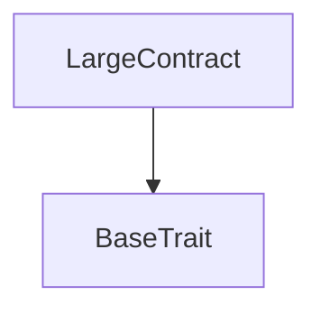
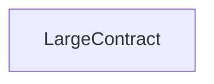

# Tact compilation report

Contract: LargeContract
BoC Size: 24912 bytes

## Structures (Structs and Messages)

Total structures: 30

### DataSize

TL-B: `_ cells:int257 bits:int257 refs:int257 = DataSize`
Signature: `DataSize{cells:int257,bits:int257,refs:int257}`

### StateInit

TL-B: `_ code:^cell data:^cell = StateInit`
Signature: `StateInit{code:^cell,data:^cell}`

### Context

TL-B: `_ bounceable:bool sender:address value:int257 raw:^slice = Context`
Signature: `Context{bounceable:bool,sender:address,value:int257,raw:^slice}`

### SendParameters

TL-B: `_ mode:int257 body:Maybe ^cell code:Maybe ^cell data:Maybe ^cell value:int257 to:address bounce:bool = SendParameters`
Signature: `SendParameters{mode:int257,body:Maybe ^cell,code:Maybe ^cell,data:Maybe ^cell,value:int257,to:address,bounce:bool}`

### DeployParameters

TL-B: `_ mode:int257 body:Maybe ^cell value:int257 bounce:bool init:StateInit{code:^cell,data:^cell} = DeployParameters`
Signature: `DeployParameters{mode:int257,body:Maybe ^cell,value:int257,bounce:bool,init:StateInit{code:^cell,data:^cell}}`

### StdAddress

TL-B: `_ workchain:int8 address:uint256 = StdAddress`
Signature: `StdAddress{workchain:int8,address:uint256}`

### VarAddress

TL-B: `_ workchain:int32 address:^slice = VarAddress`
Signature: `VarAddress{workchain:int32,address:^slice}`

### MyMessage

TL-B: `my_message#7f23a0d2  = MyMessage`
Signature: `MyMessage{}`

### Issue74$Data

TL-B: `null`
Signature: `null`

### LargeContract$Data

TL-B: `null`
Signature: `null`

### TokenInfo

TL-B: `_ ticker:^string decimals:uint8 = TokenInfo`
Signature: `TokenInfo{ticker:^string,decimals:uint8}`

### Replace

TL-B: `replace#5285f402 items:dict<int, address> = Replace`
Signature: `Replace{items:dict<int, address>}`

### Maps$Data

TL-B: `null`
Signature: `null`

### FunCKeywords

TL-B: `_ var:int257 ifnot:int257 then:int257 elseifnot:int257 int:int257 cell:int257 slice:int257 builder:int257 cont:int257 tuple:int257 type:int257 forall:int257 extern:int257 global:int257 asm:int257 impure:int257 inline_ref:int257 auto_apply:int257 method_id:int257 operator:int257 infix:int257 infixl:int257 infixr:int257 = FunCKeywords`
Signature: `FunCKeywords{var:int257,ifnot:int257,then:int257,elseifnot:int257,int:int257,cell:int257,slice:int257,builder:int257,cont:int257,tuple:int257,type:int257,forall:int257,extern:int257,global:int257,asm:int257,impure:int257,inline_ref:int257,auto_apply:int257,method_id:int257,operator:int257,infix:int257,infixl:int257,infixr:int257}`

### Bar$Data

TL-B: `null`
Signature: `null`

### Binary

TL-B: `binary#0000002a  = Binary`
Signature: `Binary{}`

### Octal

TL-B: `octal#0000002b  = Octal`
Signature: `Octal{}`

### Decimal

TL-B: `decimal#0000002c  = Decimal`
Signature: `Decimal{}`

### Hexadecimal

TL-B: `hexadecimal#0000002d  = Hexadecimal`
Signature: `Hexadecimal{}`

### Example$Data

TL-B: `null`
Signature: `null`

### Position

TL-B: `_ tokenId:uint16 foo:Maybe int257 = Position`
Signature: `Position{tokenId:uint16,foo:Maybe int257}`

### Test$Data

TL-B: `null`
Signature: `null`

### Foo

TL-B: `_ x:int257 = Foo`
Signature: `Foo{x:int257}`

### MutatingMethodOnNonLvalues$Data

TL-B: `null`
Signature: `null`

### TestGlobalFunctionShadowing$Data

TL-B: `null`
Signature: `null`

### MapUintBool$Data

TL-B: `null`
Signature: `null`

### TestContract$Data

TL-B: `null`
Signature: `null`

### Deploy

TL-B: `deploy#946a98b6 queryId:uint64 = Deploy`
Signature: `Deploy{queryId:uint64}`

### DeployOk

TL-B: `deploy_ok#aff90f57 queryId:uint64 = DeployOk`
Signature: `DeployOk{queryId:uint64}`

### FactoryDeploy

TL-B: `factory_deploy#6d0ff13b queryId:uint64 cashback:address = FactoryDeploy`
Signature: `FactoryDeploy{queryId:uint64,cashback:address}`

## Get methods

Total get methods: 76

## getTest0

Argument: index

## getTest1

Argument: index

## getTest2

Argument: index

## getTest3

Argument: index

## getTest4

Argument: index

## getTest5

Argument: index

## getTest6

Argument: index

## getTest7

Argument: index

## getTest8

Argument: index

## getTest9

Argument: index

## getTest10

Argument: index

## getTest11

Argument: index

## getTest12

Argument: index

## getTest13

Argument: index

## getTest14

Argument: index

## getTest15

Argument: index

## getTest16

Argument: index

## getTest17

Argument: index

## getTest18

Argument: index

## getTest19

Argument: index

## getTest20

Argument: index

## getTest21

Argument: index

## getTest22

Argument: index

## getTest23

Argument: index

## getTest24

Argument: index

## getTest25

Argument: index

## getTest26

Argument: index

## getTest27

Argument: index

## getTest28

Argument: index

## getTest29

Argument: index

## getTest30

Argument: index

## getTest31

Argument: index

## getTest32

Argument: index

## getTest33

Argument: index

## getTest34

Argument: index

## getTest35

Argument: index

## getTest36

Argument: index

## getTest37

Argument: index

## getTest38

Argument: index

## getTest39

Argument: index

## getTest40

Argument: index

## getTest41

Argument: index

## getTest42

Argument: index

## getTest43

Argument: index

## getTest44

Argument: index

## getTest45

Argument: index

## getTest46

Argument: index

## getTest47

Argument: index

## getTest48

Argument: index

## getTest49

Argument: index

## getTest50

Argument: index

## getTest51

Argument: index

## getTest52

Argument: index

## getTest53

Argument: index

## getTest54

Argument: index

## getTest55

Argument: index

## getTest56

Argument: index

## getTest57

Argument: index

## getTest58

Argument: index

## getTest59

Argument: index

## getTest60

Argument: index

## getTest61

Argument: index

## getTest62

Argument: index

## getTest63

Argument: index

## getTest64

Argument: index

## getTest65

Argument: index

## getTest66

Argument: index

## getTest67

Argument: index

## getTest68

Argument: index

## getTest69

Argument: index

## getTest70

Argument: index

## getTest71

Argument: index

## getTest72

Argument: index

## getTest73

Argument: index

## getTest74

Argument: index

## getTest75

Argument: index

## Exit codes

- 2: Stack underflow
- 3: Stack overflow
- 4: Integer overflow
- 5: Integer out of expected range
- 6: Invalid opcode
- 7: Type check error
- 8: Cell overflow
- 9: Cell underflow
- 10: Dictionary error
- 11: 'Unknown' error
- 12: Fatal error
- 13: Out of gas error
- 14: Virtualization error
- 32: Action list is invalid
- 33: Action list is too long
- 34: Action is invalid or not supported
- 35: Invalid source address in outbound message
- 36: Invalid destination address in outbound message
- 37: Not enough Toncoin
- 38: Not enough extra currencies
- 39: Outbound message does not fit into a cell after rewriting
- 40: Cannot process a message
- 41: Library reference is null
- 42: Library change action error
- 43: Exceeded maximum number of cells in the library or the maximum depth of the Merkle tree
- 50: Account state size exceeded limits
- 128: Null reference exception
- 129: Invalid serialization prefix
- 130: Invalid incoming message
- 131: Constraints error
- 132: Access denied
- 133: Contract stopped
- 134: Invalid argument
- 135: Code of a contract was not found
- 136: Invalid standard address

## Trait inheritance diagram

## Contract dependency diagram

