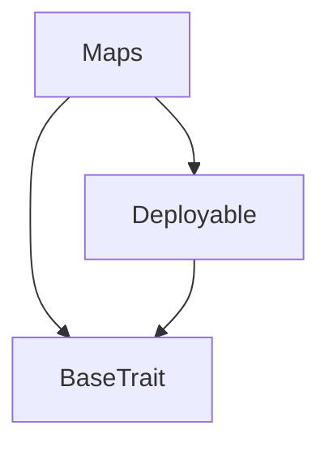
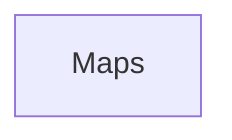

# Tact compilation report
Contract: Maps
BoC Size: 1560 bytes

## Structures (Structs and Messages)
Total structures: 32

### DataSize
TL-B: `_ cells:int257 bits:int257 refs:int257 = DataSize`
Signature: `DataSize{cells:int257,bits:int257,refs:int257}`

### StateInit
TL-B: `_ code:^cell data:^cell = StateInit`
Signature: `StateInit{code:^cell,data:^cell}`

### Context
TL-B: `_ bounceable:bool sender:address value:int257 raw:^slice = Context`
Signature: `Context{bounceable:bool,sender:address,value:int257,raw:^slice}`

### SendParameters
TL-B: `_ mode:int257 body:Maybe ^cell code:Maybe ^cell data:Maybe ^cell value:int257 to:address bounce:bool = SendParameters`
Signature: `SendParameters{mode:int257,body:Maybe ^cell,code:Maybe ^cell,data:Maybe ^cell,value:int257,to:address,bounce:bool}`

### MessageParameters
TL-B: `_ mode:int257 body:Maybe ^cell value:int257 to:address bounce:bool = MessageParameters`
Signature: `MessageParameters{mode:int257,body:Maybe ^cell,value:int257,to:address,bounce:bool}`

### DeployParameters
TL-B: `_ mode:int257 body:Maybe ^cell value:int257 bounce:bool init:StateInit{code:^cell,data:^cell} = DeployParameters`
Signature: `DeployParameters{mode:int257,body:Maybe ^cell,value:int257,bounce:bool,init:StateInit{code:^cell,data:^cell}}`

### StdAddress
TL-B: `_ workchain:int8 address:uint256 = StdAddress`
Signature: `StdAddress{workchain:int8,address:uint256}`

### VarAddress
TL-B: `_ workchain:int32 address:^slice = VarAddress`
Signature: `VarAddress{workchain:int32,address:^slice}`

### BasechainAddress
TL-B: `_ hash:Maybe int257 = BasechainAddress`
Signature: `BasechainAddress{hash:Maybe int257}`

### MyMessage
TL-B: `my_message#7f23a0d2  = MyMessage`
Signature: `MyMessage{}`

### Issue74$Data
TL-B: `_  = Issue74`
Signature: `Issue74{}`

### LargeContract$Data
TL-B: `_ testMap0:dict<int, int> testMap1:dict<int, int> testMap2:dict<int, int> testMap3:dict<int, int> testMap4:dict<int, int> testMap5:dict<int, int> testMap6:dict<int, int> testMap7:dict<int, int> testMap8:dict<int, int> testMap9:dict<int, int> testMap10:dict<int, int> testMap11:dict<int, int> testMap12:dict<int, int> testMap13:dict<int, int> testMap14:dict<int, int> testMap15:dict<int, int> testMap16:dict<int, int> testMap17:dict<int, int> testMap18:dict<int, int> testMap19:dict<int, int> testMap20:dict<int, int> testMap21:dict<int, int> testMap22:dict<int, int> testMap23:dict<int, int> testMap24:dict<int, int> testMap25:dict<int, int> testMap26:dict<int, int> testMap27:dict<int, int> testMap28:dict<int, int> testMap29:dict<int, int> testMap30:dict<int, int> testMap31:dict<int, int> testMap32:dict<int, int> testMap33:dict<int, int> testMap34:dict<int, int> testMap35:dict<int, int> testMap36:dict<int, int> testMap37:dict<int, int> testMap38:dict<int, int> testMap39:dict<int, int> testMap40:dict<int, int> testMap41:dict<int, int> testMap42:dict<int, int> testMap43:dict<int, int> testMap44:dict<int, int> testMap45:dict<int, int> testMap46:dict<int, int> testMap47:dict<int, int> testMap48:dict<int, int> testMap49:dict<int, int> testMap50:dict<int, int> testMap51:dict<int, int> testMap52:dict<int, int> testMap53:dict<int, int> testMap54:dict<int, int> testMap55:dict<int, int> testMap56:dict<int, int> testMap57:dict<int, int> testMap58:dict<int, int> testMap59:dict<int, int> testMap60:dict<int, int> testMap61:dict<int, int> testMap62:dict<int, int> = LargeContract`
Signature: `LargeContract{testMap0:dict<int, int>,testMap1:dict<int, int>,testMap2:dict<int, int>,testMap3:dict<int, int>,testMap4:dict<int, int>,testMap5:dict<int, int>,testMap6:dict<int, int>,testMap7:dict<int, int>,testMap8:dict<int, int>,testMap9:dict<int, int>,testMap10:dict<int, int>,testMap11:dict<int, int>,testMap12:dict<int, int>,testMap13:dict<int, int>,testMap14:dict<int, int>,testMap15:dict<int, int>,testMap16:dict<int, int>,testMap17:dict<int, int>,testMap18:dict<int, int>,testMap19:dict<int, int>,testMap20:dict<int, int>,testMap21:dict<int, int>,testMap22:dict<int, int>,testMap23:dict<int, int>,testMap24:dict<int, int>,testMap25:dict<int, int>,testMap26:dict<int, int>,testMap27:dict<int, int>,testMap28:dict<int, int>,testMap29:dict<int, int>,testMap30:dict<int, int>,testMap31:dict<int, int>,testMap32:dict<int, int>,testMap33:dict<int, int>,testMap34:dict<int, int>,testMap35:dict<int, int>,testMap36:dict<int, int>,testMap37:dict<int, int>,testMap38:dict<int, int>,testMap39:dict<int, int>,testMap40:dict<int, int>,testMap41:dict<int, int>,testMap42:dict<int, int>,testMap43:dict<int, int>,testMap44:dict<int, int>,testMap45:dict<int, int>,testMap46:dict<int, int>,testMap47:dict<int, int>,testMap48:dict<int, int>,testMap49:dict<int, int>,testMap50:dict<int, int>,testMap51:dict<int, int>,testMap52:dict<int, int>,testMap53:dict<int, int>,testMap54:dict<int, int>,testMap55:dict<int, int>,testMap56:dict<int, int>,testMap57:dict<int, int>,testMap58:dict<int, int>,testMap59:dict<int, int>,testMap60:dict<int, int>,testMap61:dict<int, int>,testMap62:dict<int, int>}`

### TokenInfo
TL-B: `_ ticker:^string decimals:uint8 = TokenInfo`
Signature: `TokenInfo{ticker:^string,decimals:uint8}`

### Replace
TL-B: `replace#5285f402 items:dict<int, address> = Replace`
Signature: `Replace{items:dict<int, address>}`

### Maps$Data
TL-B: `_ mi1:dict<int, ^TokenInfo{ticker:^string,decimals:uint8}> mi2:dict<int, bool> mi3:dict<int, int> mi4:dict<int, address> ma1:dict<address, ^TokenInfo{ticker:^string,decimals:uint8}> ma2:dict<address, bool> ma3:dict<address, int> ma4:dict<address, address> = Maps`
Signature: `Maps{mi1:dict<int, ^TokenInfo{ticker:^string,decimals:uint8}>,mi2:dict<int, bool>,mi3:dict<int, int>,mi4:dict<int, address>,ma1:dict<address, ^TokenInfo{ticker:^string,decimals:uint8}>,ma2:dict<address, bool>,ma3:dict<address, int>,ma4:dict<address, address>}`

### FunCKeywords
TL-B: `_ var:int257 ifnot:int257 then:int257 elseifnot:int257 int:int257 cell:int257 slice:int257 builder:int257 cont:int257 tuple:int257 type:int257 forall:int257 extern:int257 global:int257 asm:int257 impure:int257 inline_ref:int257 auto_apply:int257 method_id:int257 operator:int257 infix:int257 infixl:int257 infixr:int257 = FunCKeywords`
Signature: `FunCKeywords{var:int257,ifnot:int257,then:int257,elseifnot:int257,int:int257,cell:int257,slice:int257,builder:int257,cont:int257,tuple:int257,type:int257,forall:int257,extern:int257,global:int257,asm:int257,impure:int257,inline_ref:int257,auto_apply:int257,method_id:int257,operator:int257,infix:int257,infixl:int257,infixr:int257}`

### Bar$Data
TL-B: `_ f:FunCKeywords{var:int257,ifnot:int257,then:int257,elseifnot:int257,int:int257,cell:int257,slice:int257,builder:int257,cont:int257,tuple:int257,type:int257,forall:int257,extern:int257,global:int257,asm:int257,impure:int257,inline_ref:int257,auto_apply:int257,method_id:int257,operator:int257,infix:int257,infixl:int257,infixr:int257} = Bar`
Signature: `Bar{f:FunCKeywords{var:int257,ifnot:int257,then:int257,elseifnot:int257,int:int257,cell:int257,slice:int257,builder:int257,cont:int257,tuple:int257,type:int257,forall:int257,extern:int257,global:int257,asm:int257,impure:int257,inline_ref:int257,auto_apply:int257,method_id:int257,operator:int257,infix:int257,infixl:int257,infixr:int257}}`

### Binary
TL-B: `binary#0000002a  = Binary`
Signature: `Binary{}`

### Octal
TL-B: `octal#0000002b  = Octal`
Signature: `Octal{}`

### Decimal
TL-B: `decimal#0000002c  = Decimal`
Signature: `Decimal{}`

### Hexadecimal
TL-B: `hexadecimal#0000002d  = Hexadecimal`
Signature: `Hexadecimal{}`

### Example$Data
TL-B: `_  = Example`
Signature: `Example{}`

### Position
TL-B: `_ tokenId:uint16 foo:Maybe int257 = Position`
Signature: `Position{tokenId:uint16,foo:Maybe int257}`

### Test$Data
TL-B: `_  = Test`
Signature: `Test{}`

### Foo
TL-B: `_ x:int257 = Foo`
Signature: `Foo{x:int257}`

### MutatingMethodOnNonLvalues$Data
TL-B: `_  = MutatingMethodOnNonLvalues`
Signature: `MutatingMethodOnNonLvalues{}`

### TestGlobalFunctionShadowing$Data
TL-B: `_  = TestGlobalFunctionShadowing`
Signature: `TestGlobalFunctionShadowing{}`

### MapUintBool$Data
TL-B: `_ m:dict<uint64, bool> = MapUintBool`
Signature: `MapUintBool{m:dict<uint64, bool>}`

### TestContract$Data
TL-B: `_  = TestContract`
Signature: `TestContract{}`

### Deploy
TL-B: `deploy#946a98b6 queryId:uint64 = Deploy`
Signature: `Deploy{queryId:uint64}`

### DeployOk
TL-B: `deploy_ok#aff90f57 queryId:uint64 = DeployOk`
Signature: `DeployOk{queryId:uint64}`

### FactoryDeploy
TL-B: `factory_deploy#6d0ff13b queryId:uint64 cashback:address = FactoryDeploy`
Signature: `FactoryDeploy{queryId:uint64,cashback:address}`

## Get methods
Total get methods: 3

## oneItem
Argument: key

## itemCheck
No arguments

## allItems
No arguments

## Exit codes
* 2: Stack underflow
* 3: Stack overflow
* 4: Integer overflow
* 5: Integer out of expected range
* 6: Invalid opcode
* 7: Type check error
* 8: Cell overflow
* 9: Cell underflow
* 10: Dictionary error
* 11: 'Unknown' error
* 12: Fatal error
* 13: Out of gas error
* 14: Virtualization error
* 32: Action list is invalid
* 33: Action list is too long
* 34: Action is invalid or not supported
* 35: Invalid source address in outbound message
* 36: Invalid destination address in outbound message
* 37: Not enough Toncoin
* 38: Not enough extra currencies
* 39: Outbound message does not fit into a cell after rewriting
* 40: Cannot process a message
* 41: Library reference is null
* 42: Library change action error
* 43: Exceeded maximum number of cells in the library or the maximum depth of the Merkle tree
* 50: Account state size exceeded limits
* 128: Null reference exception
* 129: Invalid serialization prefix
* 130: Invalid incoming message
* 131: Constraints error
* 132: Access denied
* 133: Contract stopped
* 134: Invalid argument
* 135: Code of a contract was not found
* 136: Invalid standard address

## Trait inheritance diagram

## Contract dependency diagram

