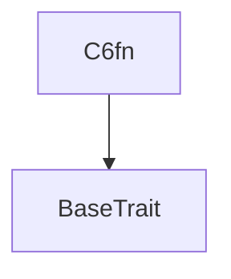
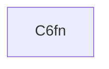

# Tact compilation report

Contract: C6fn
BoC Size: 106 bytes

## Structures (Structs and Messages)

Total structures: 18

### DataSize

TL-B: `_ cells:int257 bits:int257 refs:int257 = DataSize`
Signature: `DataSize{cells:int257,bits:int257,refs:int257}`

### StateInit

TL-B: `_ code:^cell data:^cell = StateInit`
Signature: `StateInit{code:^cell,data:^cell}`

### Context

TL-B: `_ bounceable:bool sender:address value:int257 raw:^slice = Context`
Signature: `Context{bounceable:bool,sender:address,value:int257,raw:^slice}`

### SendParameters

TL-B: `_ mode:int257 body:Maybe ^cell code:Maybe ^cell data:Maybe ^cell value:int257 to:address bounce:bool = SendParameters`
Signature: `SendParameters{mode:int257,body:Maybe ^cell,code:Maybe ^cell,data:Maybe ^cell,value:int257,to:address,bounce:bool}`

### DeployParameters

TL-B: `_ mode:int257 body:Maybe ^cell value:int257 bounce:bool init:StateInit{code:^cell,data:^cell} = DeployParameters`
Signature: `DeployParameters{mode:int257,body:Maybe ^cell,value:int257,bounce:bool,init:StateInit{code:^cell,data:^cell}}`

### StdAddress

TL-B: `_ workchain:int8 address:uint256 = StdAddress`
Signature: `StdAddress{workchain:int8,address:uint256}`

### VarAddress

TL-B: `_ workchain:int32 address:^slice = VarAddress`
Signature: `VarAddress{workchain:int32,address:^slice}`

### C1$Data

TL-B: `null`
Signature: `null`

### C2$Data

TL-B: `null`
Signature: `null`

### C3f$Data

TL-B: `null`
Signature: `null`

### C4g$Data

TL-B: `null`
Signature: `null`

### C5i$Data

TL-B: `null`
Signature: `null`

### C6fn$Data

TL-B: `null`
Signature: `null`

### C7gt$Data

TL-B: `null`
Signature: `null`

### C8h$Data

TL-B: `null`
Signature: `null`

### C9g2$Data

TL-B: `null`
Signature: `null`

### C10o$Data

TL-B: `null`
Signature: `null`

### Tester$Data

TL-B: `null`
Signature: `null`

## Get methods

Total get methods: 1

## incrAndGetField1

Argument: n

## Exit codes

- 2: Stack underflow
- 3: Stack overflow
- 4: Integer overflow
- 5: Integer out of expected range
- 6: Invalid opcode
- 7: Type check error
- 8: Cell overflow
- 9: Cell underflow
- 10: Dictionary error
- 11: 'Unknown' error
- 12: Fatal error
- 13: Out of gas error
- 14: Virtualization error
- 32: Action list is invalid
- 33: Action list is too long
- 34: Action is invalid or not supported
- 35: Invalid source address in outbound message
- 36: Invalid destination address in outbound message
- 37: Not enough Toncoin
- 38: Not enough extra currencies
- 39: Outbound message does not fit into a cell after rewriting
- 40: Cannot process a message
- 41: Library reference is null
- 42: Library change action error
- 43: Exceeded maximum number of cells in the library or the maximum depth of the Merkle tree
- 50: Account state size exceeded limits
- 128: Null reference exception
- 129: Invalid serialization prefix
- 130: Invalid incoming message
- 131: Constraints error
- 132: Access denied
- 133: Contract stopped
- 134: Invalid argument
- 135: Code of a contract was not found
- 136: Invalid standard address

## Trait inheritance diagram

## Contract dependency diagram

