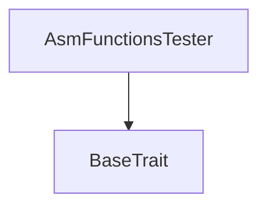
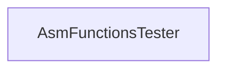

# Tact compilation report
Contract: AsmFunctionsTester
BoC Size: 574 bytes

## Structures (Structs and Messages)
Total structures: 13

### DataSize
TL-B: `_ cells:int257 bits:int257 refs:int257 = DataSize`
Signature: `DataSize{cells:int257,bits:int257,refs:int257}`

### StateInit
TL-B: `_ code:^cell data:^cell = StateInit`
Signature: `StateInit{code:^cell,data:^cell}`

### Context
TL-B: `_ bounceable:bool sender:address value:int257 raw:^slice = Context`
Signature: `Context{bounceable:bool,sender:address,value:int257,raw:^slice}`

### SendParameters
TL-B: `_ mode:int257 body:Maybe ^cell code:Maybe ^cell data:Maybe ^cell value:int257 to:address bounce:bool = SendParameters`
Signature: `SendParameters{mode:int257,body:Maybe ^cell,code:Maybe ^cell,data:Maybe ^cell,value:int257,to:address,bounce:bool}`

### DeployParameters
TL-B: `_ mode:int257 body:Maybe ^cell value:int257 bounce:bool init:StateInit{code:^cell,data:^cell} = DeployParameters`
Signature: `DeployParameters{mode:int257,body:Maybe ^cell,value:int257,bounce:bool,init:StateInit{code:^cell,data:^cell}}`

### StdAddress
TL-B: `_ workchain:int8 address:uint256 = StdAddress`
Signature: `StdAddress{workchain:int8,address:uint256}`

### VarAddress
TL-B: `_ workchain:int32 address:^slice = VarAddress`
Signature: `VarAddress{workchain:int32,address:^slice}`

### AsmFunctionsTester$Data
TL-B: `null`
Signature: `null`

### MapIntIntSlice
TL-B: `_ val:dict<int, int> rem:^slice = MapIntIntSlice`
Signature: `MapIntIntSlice{val:dict<int, int>,rem:^slice}`

### IntSlice
TL-B: `_ val:int257 rem:^slice = IntSlice`
Signature: `IntSlice{val:int257,rem:^slice}`

### SliceInt
TL-B: `_ rem:^slice val:int257 = SliceInt`
Signature: `SliceInt{rem:^slice,val:int257}`

### Two
TL-B: `_ a:int257 b:int257 = Two`
Signature: `Two{a:int257,b:int257}`

### TwoInTwo
TL-B: `_ a:Two{a:int257,b:int257} b:Two{a:int257,b:int257} = TwoInTwo`
Signature: `TwoInTwo{a:Two{a:int257,b:int257},b:Two{a:int257,b:int257}}`

## Get methods
Total get methods: 11

## testAsmStoreDict
No arguments

## testAsmLoadCoins
No arguments

## testAsmLoadCoinsMut
No arguments

## testAsmLoadCoinsMutRuntime
Argument: c

## testAsmLoadInt
No arguments

## testAsmDebugStr
No arguments

## testAsmCreateUseWord
No arguments

## testAsmSecondToLast
No arguments

## testAsmSecondToLastRuntime
Argument: s1
Argument: s2

## testAsmFirst
No arguments

## testAsmFirstRuntime
Argument: s1
Argument: s2
Argument: s3

## Exit codes
* 2: Stack underflow
* 3: Stack overflow
* 4: Integer overflow
* 5: Integer out of expected range
* 6: Invalid opcode
* 7: Type check error
* 8: Cell overflow
* 9: Cell underflow
* 10: Dictionary error
* 11: 'Unknown' error
* 12: Fatal error
* 13: Out of gas error
* 14: Virtualization error
* 32: Action list is invalid
* 33: Action list is too long
* 34: Action is invalid or not supported
* 35: Invalid source address in outbound message
* 36: Invalid destination address in outbound message
* 37: Not enough Toncoin
* 38: Not enough extra currencies
* 39: Outbound message does not fit into a cell after rewriting
* 40: Cannot process a message
* 41: Library reference is null
* 42: Library change action error
* 43: Exceeded maximum number of cells in the library or the maximum depth of the Merkle tree
* 50: Account state size exceeded limits
* 128: Null reference exception
* 129: Invalid serialization prefix
* 130: Invalid incoming message
* 131: Constraints error
* 132: Access denied
* 133: Contract stopped
* 134: Invalid argument
* 135: Code of a contract was not found
* 136: Invalid standard address

## Trait inheritance diagram

## Contract dependency diagram

