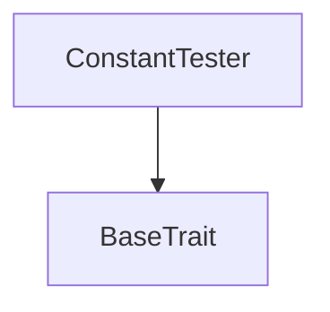
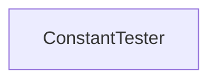

# Tact compilation report
Contract: ConstantTester
BoC Size: 2018 bytes

## Structures (Structs and Messages)
Total structures: 13

### DataSize
TL-B: `_ cells:int257 bits:int257 refs:int257 = DataSize`
Signature: `DataSize{cells:int257,bits:int257,refs:int257}`

### StateInit
TL-B: `_ code:^cell data:^cell = StateInit`
Signature: `StateInit{code:^cell,data:^cell}`

### Context
TL-B: `_ bounceable:bool sender:address value:int257 raw:^slice = Context`
Signature: `Context{bounceable:bool,sender:address,value:int257,raw:^slice}`

### SendParameters
TL-B: `_ mode:int257 body:Maybe ^cell code:Maybe ^cell data:Maybe ^cell value:int257 to:address bounce:bool = SendParameters`
Signature: `SendParameters{mode:int257,body:Maybe ^cell,code:Maybe ^cell,data:Maybe ^cell,value:int257,to:address,bounce:bool}`

### MessageParameters
TL-B: `_ mode:int257 body:Maybe ^cell value:int257 to:address bounce:bool = MessageParameters`
Signature: `MessageParameters{mode:int257,body:Maybe ^cell,value:int257,to:address,bounce:bool}`

### DeployParameters
TL-B: `_ mode:int257 body:Maybe ^cell value:int257 bounce:bool init:StateInit{code:^cell,data:^cell} = DeployParameters`
Signature: `DeployParameters{mode:int257,body:Maybe ^cell,value:int257,bounce:bool,init:StateInit{code:^cell,data:^cell}}`

### StdAddress
TL-B: `_ workchain:int8 address:uint256 = StdAddress`
Signature: `StdAddress{workchain:int8,address:uint256}`

### VarAddress
TL-B: `_ workchain:int32 address:^slice = VarAddress`
Signature: `VarAddress{workchain:int32,address:^slice}`

### BasechainAddress
TL-B: `_ hash:Maybe int257 = BasechainAddress`
Signature: `BasechainAddress{hash:Maybe int257}`

### A
TL-B: `_ b:int257 = A`
Signature: `A{b:int257}`

### S
TL-B: `_ a:bool b:int257 = S`
Signature: `S{a:bool,b:int257}`

### T
TL-B: `_ a:int257 s:S{a:bool,b:int257} = T`
Signature: `T{a:int257,s:S{a:bool,b:int257}}`

### ConstantTester$Data
TL-B: `_  = ConstantTester`
Signature: `ConstantTester{}`

## Get methods
Total get methods: 66

## something1
No arguments

## something2
No arguments

## something3
No arguments

## something4
No arguments

## something5
No arguments

## something6
No arguments

## something7
No arguments

## something8
No arguments

## something9
No arguments

## something10
No arguments

## something11
No arguments

## something12
No arguments

## something13
No arguments

## something14
No arguments

## something15
No arguments

## something16
No arguments

## something17
No arguments

## something18
No arguments

## something19
No arguments

## something20
No arguments

## something21
No arguments

## something22
No arguments

## something23
No arguments

## something24
No arguments

## something25
No arguments

## something26
No arguments

## something27
No arguments

## something28
No arguments

## something29
No arguments

## something30
No arguments

## something31
No arguments

## something32
No arguments

## something33
No arguments

## something34
No arguments

## something35
No arguments

## something36
No arguments

## something37
No arguments

## something38
No arguments

## something39
No arguments

## something40
No arguments

## something41
No arguments

## something42
No arguments

## something43
No arguments

## something44
No arguments

## something45
No arguments

## globalConst1
No arguments

## globalConst2
No arguments

## globalConst3
No arguments

## globalConst4
No arguments

## globalConst5
No arguments

## globalConst6
No arguments

## globalConst7
No arguments

## globalConst8
No arguments

## globalConst9
No arguments

## globalConst10
No arguments

## globalConst11
No arguments

## globalConst12
No arguments

## globalConst13
No arguments

## beforeDefinedA
No arguments

## beforeDefinedC
No arguments

## defaultFieldB
No arguments

## noCircularA
No arguments

## minInt1
No arguments

## minInt2
No arguments

## minInt3
No arguments

## globalConst
No arguments

## Exit codes
* 2: Stack underflow
* 3: Stack overflow
* 4: Integer overflow
* 5: Integer out of expected range
* 6: Invalid opcode
* 7: Type check error
* 8: Cell overflow
* 9: Cell underflow
* 10: Dictionary error
* 11: 'Unknown' error
* 12: Fatal error
* 13: Out of gas error
* 14: Virtualization error
* 32: Action list is invalid
* 33: Action list is too long
* 34: Action is invalid or not supported
* 35: Invalid source address in outbound message
* 36: Invalid destination address in outbound message
* 37: Not enough Toncoin
* 38: Not enough extra currencies
* 39: Outbound message does not fit into a cell after rewriting
* 40: Cannot process a message
* 41: Library reference is null
* 42: Library change action error
* 43: Exceeded maximum number of cells in the library or the maximum depth of the Merkle tree
* 50: Account state size exceeded limits
* 128: Null reference exception
* 129: Invalid serialization prefix
* 130: Invalid incoming message
* 131: Constraints error
* 132: Access denied
* 133: Contract stopped
* 134: Invalid argument
* 135: Code of a contract was not found
* 136: Invalid standard address

## Trait inheritance diagram

## Contract dependency diagram

