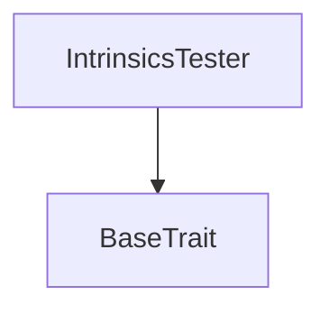
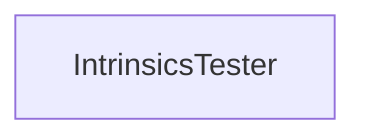

# Tact compilation report
Contract: IntrinsicsTester
BoC Size: 2577 bytes

## Structures (Structs and Messages)
Total structures: 10

### DataSize
TL-B: `_ cells:int257 bits:int257 refs:int257 = DataSize`
Signature: `DataSize{cells:int257,bits:int257,refs:int257}`

### StateInit
TL-B: `_ code:^cell data:^cell = StateInit`
Signature: `StateInit{code:^cell,data:^cell}`

### Context
TL-B: `_ bounceable:bool sender:address value:int257 raw:^slice = Context`
Signature: `Context{bounceable:bool,sender:address,value:int257,raw:^slice}`

### SendParameters
TL-B: `_ mode:int257 body:Maybe ^cell code:Maybe ^cell data:Maybe ^cell value:int257 to:address bounce:bool = SendParameters`
Signature: `SendParameters{mode:int257,body:Maybe ^cell,code:Maybe ^cell,data:Maybe ^cell,value:int257,to:address,bounce:bool}`

### MessageParameters
TL-B: `_ mode:int257 body:Maybe ^cell value:int257 to:address bounce:bool = MessageParameters`
Signature: `MessageParameters{mode:int257,body:Maybe ^cell,value:int257,to:address,bounce:bool}`

### DeployParameters
TL-B: `_ mode:int257 body:Maybe ^cell value:int257 bounce:bool init:StateInit{code:^cell,data:^cell} = DeployParameters`
Signature: `DeployParameters{mode:int257,body:Maybe ^cell,value:int257,bounce:bool,init:StateInit{code:^cell,data:^cell}}`

### StdAddress
TL-B: `_ workchain:int8 address:uint256 = StdAddress`
Signature: `StdAddress{workchain:int8,address:uint256}`

### VarAddress
TL-B: `_ workchain:int32 address:^slice = VarAddress`
Signature: `VarAddress{workchain:int32,address:^slice}`

### BasechainAddress
TL-B: `_ hash:Maybe int257 = BasechainAddress`
Signature: `BasechainAddress{hash:Maybe int257}`

### IntrinsicsTester$Data
TL-B: `_ a:int257 b:^string c:address d:^cell e:int257 f:int257 g:^slice h:^slice i:int257 j:int257 k:int257 l:int257 m:^slice n:^slice o:^slice p:^slice q:^slice r:^slice s:^slice t:^slice u:^slice w:^slice v:^slice = IntrinsicsTester`
Signature: `IntrinsicsTester{a:int257,b:^string,c:address,d:^cell,e:int257,f:int257,g:^slice,h:^slice,i:int257,j:int257,k:int257,l:int257,m:^slice,n:^slice,o:^slice,p:^slice,q:^slice,r:^slice,s:^slice,t:^slice,u:^slice,w:^slice,v:^slice}`

## Get methods
Total get methods: 55

## getTons
No arguments

## getTons2
No arguments

## getString
No arguments

## getString2
No arguments

## getAddress
No arguments

## getAddress2
No arguments

## getCell
No arguments

## getCell2
No arguments

## getPow
No arguments

## getPow2
No arguments

## getComment
No arguments

## getHash
No arguments

## getHashSlice
No arguments

## getHash2
No arguments

## getHash3
Argument: src

## getHash4
Argument: src

## getHashLongComptime
No arguments

## getHashLongRuntime
Argument: src

## getHashLongRuntimeSlice
Argument: src

## getHashSHA256U
Argument: src

## getHashHASHEXTSHA256
Argument: src

## getSlice
No arguments

## getSlice2
No arguments

## getRawSlice
No arguments

## getRawSlice2
No arguments

## getRawSlice3
No arguments

## getRawSlice4
No arguments

## getAscii
No arguments

## getAscii2
No arguments

## getAscii3
No arguments

## getAscii4
No arguments

## getCrc32
No arguments

## getCrc32_2
No arguments

## getCrc32_3
No arguments

## getCrc32_4
No arguments

## getRawSlice5
No arguments

## getRawSlice6
No arguments

## getRawSlice7
No arguments

## getRawSlice8
No arguments

## getRawSlice9
No arguments

## getRawSlice10
No arguments

## getRawSlice11
No arguments

## getRawSlice12
No arguments

## getRawSlice13
No arguments

## getRawSlice14
No arguments

## getRawSlice15
No arguments

## getRawSlice16
No arguments

## getRawSlice17
No arguments

## getRawSlice18
No arguments

## getRawSlice19
No arguments

## getRawSlice20
No arguments

## getRawSlice21
No arguments

## getRawSlice22
No arguments

## getRawSlice23
No arguments

## getRawSlice24
No arguments

## Exit codes
* 2: Stack underflow
* 3: Stack overflow
* 4: Integer overflow
* 5: Integer out of expected range
* 6: Invalid opcode
* 7: Type check error
* 8: Cell overflow
* 9: Cell underflow
* 10: Dictionary error
* 11: 'Unknown' error
* 12: Fatal error
* 13: Out of gas error
* 14: Virtualization error
* 32: Action list is invalid
* 33: Action list is too long
* 34: Action is invalid or not supported
* 35: Invalid source address in outbound message
* 36: Invalid destination address in outbound message
* 37: Not enough Toncoin
* 38: Not enough extra currencies
* 39: Outbound message does not fit into a cell after rewriting
* 40: Cannot process a message
* 41: Library reference is null
* 42: Library change action error
* 43: Exceeded maximum number of cells in the library or the maximum depth of the Merkle tree
* 50: Account state size exceeded limits
* 128: Null reference exception
* 129: Invalid serialization prefix
* 130: Invalid incoming message
* 131: Constraints error
* 132: Access denied
* 133: Contract stopped
* 134: Invalid argument
* 135: Code of a contract was not found
* 136: Invalid standard address

## Trait inheritance diagram

## Contract dependency diagram

