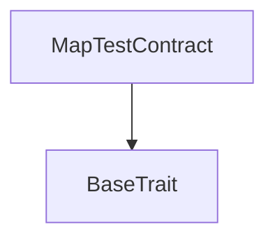
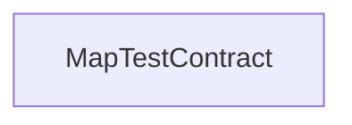

# Tact compilation report

Contract: MapTestContract
BoC Size: 22439 bytes

## Structures (Structs and Messages)

Total structures: 20

### DataSize

TL-B: `_ cells:int257 bits:int257 refs:int257 = DataSize`
Signature: `DataSize{cells:int257,bits:int257,refs:int257}`

### StateInit

TL-B: `_ code:^cell data:^cell = StateInit`
Signature: `StateInit{code:^cell,data:^cell}`

### Context

TL-B: `_ bounceable:bool sender:address value:int257 raw:^slice = Context`
Signature: `Context{bounceable:bool,sender:address,value:int257,raw:^slice}`

### SendParameters

TL-B: `_ mode:int257 body:Maybe ^cell code:Maybe ^cell data:Maybe ^cell value:int257 to:address bounce:bool = SendParameters`
Signature: `SendParameters{mode:int257,body:Maybe ^cell,code:Maybe ^cell,data:Maybe ^cell,value:int257,to:address,bounce:bool}`

### DeployParameters

TL-B: `_ mode:int257 body:Maybe ^cell value:int257 bounce:bool init:StateInit{code:^cell,data:^cell} = DeployParameters`
Signature: `DeployParameters{mode:int257,body:Maybe ^cell,value:int257,bounce:bool,init:StateInit{code:^cell,data:^cell}}`

### StdAddress

TL-B: `_ workchain:int8 address:uint256 = StdAddress`
Signature: `StdAddress{workchain:int8,address:uint256}`

### VarAddress

TL-B: `_ workchain:int32 address:^slice = VarAddress`
Signature: `VarAddress{workchain:int32,address:^slice}`

### SomeStruct

TL-B: `_ int:int257 bool:bool address:address a:int257 b:int257 = SomeStruct`
Signature: `SomeStruct{int:int257,bool:bool,address:address,a:int257,b:int257}`

### GetAllMapsResult

TL-B: `_ int_varint16:Maybe int257 int_varint32:Maybe int257 int_varuint16:Maybe int257 int_varuint32:Maybe int257 int_bool:Maybe bool int_cell:Maybe ^cell int_address:Maybe address int_struct:Maybe SomeStruct{int:int257,bool:bool,address:address,a:int257,b:int257} int8_varint16:Maybe int257 int8_varint32:Maybe int257 int8_varuint16:Maybe int257 int8_varuint32:Maybe int257 int8_bool:Maybe bool int8_cell:Maybe ^cell int8_address:Maybe address int8_struct:Maybe SomeStruct{int:int257,bool:bool,address:address,a:int257,b:int257} int42_varint16:Maybe int257 int42_varint32:Maybe int257 int42_varuint16:Maybe int257 int42_varuint32:Maybe int257 int42_bool:Maybe bool int42_cell:Maybe ^cell int42_address:Maybe address int42_struct:Maybe SomeStruct{int:int257,bool:bool,address:address,a:int257,b:int257} int256_varint16:Maybe int257 int256_varint32:Maybe int257 int256_varuint16:Maybe int257 int256_varuint32:Maybe int257 int256_bool:Maybe bool int256_cell:Maybe ^cell int256_address:Maybe address int256_struct:Maybe SomeStruct{int:int257,bool:bool,address:address,a:int257,b:int257} uint8_varint16:Maybe int257 uint8_varint32:Maybe int257 uint8_varuint16:Maybe int257 uint8_varuint32:Maybe int257 uint8_bool:Maybe bool uint8_cell:Maybe ^cell uint8_address:Maybe address uint8_struct:Maybe SomeStruct{int:int257,bool:bool,address:address,a:int257,b:int257} uint42_varint16:Maybe int257 uint42_varint32:Maybe int257 uint42_varuint16:Maybe int257 uint42_varuint32:Maybe int257 uint42_bool:Maybe bool uint42_cell:Maybe ^cell uint42_address:Maybe address uint42_struct:Maybe SomeStruct{int:int257,bool:bool,address:address,a:int257,b:int257} uint256_varint16:Maybe int257 uint256_varint32:Maybe int257 uint256_varuint16:Maybe int257 uint256_varuint32:Maybe int257 uint256_bool:Maybe bool uint256_cell:Maybe ^cell uint256_address:Maybe address uint256_struct:Maybe SomeStruct{int:int257,bool:bool,address:address,a:int257,b:int257} address_varint16:Maybe int257 address_varint32:Maybe int257 address_varuint16:Maybe int257 address_varuint32:Maybe int257 address_bool:Maybe bool address_cell:Maybe ^cell address_address:Maybe address address_struct:Maybe SomeStruct{int:int257,bool:bool,address:address,a:int257,b:int257} = GetAllMapsResult`
Signature: `GetAllMapsResult{int_varint16:Maybe int257,int_varint32:Maybe int257,int_varuint16:Maybe int257,int_varuint32:Maybe int257,int_bool:Maybe bool,int_cell:Maybe ^cell,int_address:Maybe address,int_struct:Maybe SomeStruct{int:int257,bool:bool,address:address,a:int257,b:int257},int8_varint16:Maybe int257,int8_varint32:Maybe int257,int8_varuint16:Maybe int257,int8_varuint32:Maybe int257,int8_bool:Maybe bool,int8_cell:Maybe ^cell,int8_address:Maybe address,int8_struct:Maybe SomeStruct{int:int257,bool:bool,address:address,a:int257,b:int257},int42_varint16:Maybe int257,int42_varint32:Maybe int257,int42_varuint16:Maybe int257,int42_varuint32:Maybe int257,int42_bool:Maybe bool,int42_cell:Maybe ^cell,int42_address:Maybe address,int42_struct:Maybe SomeStruct{int:int257,bool:bool,address:address,a:int257,b:int257},int256_varint16:Maybe int257,int256_varint32:Maybe int257,int256_varuint16:Maybe int257,int256_varuint32:Maybe int257,int256_bool:Maybe bool,int256_cell:Maybe ^cell,int256_address:Maybe address,int256_struct:Maybe SomeStruct{int:int257,bool:bool,address:address,a:int257,b:int257},uint8_varint16:Maybe int257,uint8_varint32:Maybe int257,uint8_varuint16:Maybe int257,uint8_varuint32:Maybe int257,uint8_bool:Maybe bool,uint8_cell:Maybe ^cell,uint8_address:Maybe address,uint8_struct:Maybe SomeStruct{int:int257,bool:bool,address:address,a:int257,b:int257},uint42_varint16:Maybe int257,uint42_varint32:Maybe int257,uint42_varuint16:Maybe int257,uint42_varuint32:Maybe int257,uint42_bool:Maybe bool,uint42_cell:Maybe ^cell,uint42_address:Maybe address,uint42_struct:Maybe SomeStruct{int:int257,bool:bool,address:address,a:int257,b:int257},uint256_varint16:Maybe int257,uint256_varint32:Maybe int257,uint256_varuint16:Maybe int257,uint256_varuint32:Maybe int257,uint256_bool:Maybe bool,uint256_cell:Maybe ^cell,uint256_address:Maybe address,uint256_struct:Maybe SomeStruct{int:int257,bool:bool,address:address,a:int257,b:int257},address_varint16:Maybe int257,address_varint32:Maybe int257,address_varuint16:Maybe int257,address_varuint32:Maybe int257,address_bool:Maybe bool,address_cell:Maybe ^cell,address_address:Maybe address,address_struct:Maybe SomeStruct{int:int257,bool:bool,address:address,a:int257,b:int257}}`

### ReplaceAllMapsResult

TL-B: `_ int_varint16:bool int_varint32:bool int_varuint16:bool int_varuint32:bool int_bool:bool int_cell:bool int_address:bool int_struct:bool int8_varint16:bool int8_varint32:bool int8_varuint16:bool int8_varuint32:bool int8_bool:bool int8_cell:bool int8_address:bool int8_struct:bool int42_varint16:bool int42_varint32:bool int42_varuint16:bool int42_varuint32:bool int42_bool:bool int42_cell:bool int42_address:bool int42_struct:bool int256_varint16:bool int256_varint32:bool int256_varuint16:bool int256_varuint32:bool int256_bool:bool int256_cell:bool int256_address:bool int256_struct:bool uint8_varint16:bool uint8_varint32:bool uint8_varuint16:bool uint8_varuint32:bool uint8_bool:bool uint8_cell:bool uint8_address:bool uint8_struct:bool uint42_varint16:bool uint42_varint32:bool uint42_varuint16:bool uint42_varuint32:bool uint42_bool:bool uint42_cell:bool uint42_address:bool uint42_struct:bool uint256_varint16:bool uint256_varint32:bool uint256_varuint16:bool uint256_varuint32:bool uint256_bool:bool uint256_cell:bool uint256_address:bool uint256_struct:bool address_varint16:bool address_varint32:bool address_varuint16:bool address_varuint32:bool address_bool:bool address_cell:bool address_address:bool address_struct:bool = ReplaceAllMapsResult`
Signature: `ReplaceAllMapsResult{int_varint16:bool,int_varint32:bool,int_varuint16:bool,int_varuint32:bool,int_bool:bool,int_cell:bool,int_address:bool,int_struct:bool,int8_varint16:bool,int8_varint32:bool,int8_varuint16:bool,int8_varuint32:bool,int8_bool:bool,int8_cell:bool,int8_address:bool,int8_struct:bool,int42_varint16:bool,int42_varint32:bool,int42_varuint16:bool,int42_varuint32:bool,int42_bool:bool,int42_cell:bool,int42_address:bool,int42_struct:bool,int256_varint16:bool,int256_varint32:bool,int256_varuint16:bool,int256_varuint32:bool,int256_bool:bool,int256_cell:bool,int256_address:bool,int256_struct:bool,uint8_varint16:bool,uint8_varint32:bool,uint8_varuint16:bool,uint8_varuint32:bool,uint8_bool:bool,uint8_cell:bool,uint8_address:bool,uint8_struct:bool,uint42_varint16:bool,uint42_varint32:bool,uint42_varuint16:bool,uint42_varuint32:bool,uint42_bool:bool,uint42_cell:bool,uint42_address:bool,uint42_struct:bool,uint256_varint16:bool,uint256_varint32:bool,uint256_varuint16:bool,uint256_varuint32:bool,uint256_bool:bool,uint256_cell:bool,uint256_address:bool,uint256_struct:bool,address_varint16:bool,address_varint32:bool,address_varuint16:bool,address_varuint32:bool,address_bool:bool,address_cell:bool,address_address:bool,address_struct:bool}`

### ReplaceGetAllMapsResult

TL-B: `_ int_varint16:Maybe int257 int_varint32:Maybe int257 int_varuint16:Maybe int257 int_varuint32:Maybe int257 int_bool:Maybe bool int_cell:Maybe ^cell int_address:Maybe address int_struct:Maybe SomeStruct{int:int257,bool:bool,address:address,a:int257,b:int257} int8_varint16:Maybe int257 int8_varint32:Maybe int257 int8_varuint16:Maybe int257 int8_varuint32:Maybe int257 int8_bool:Maybe bool int8_cell:Maybe ^cell int8_address:Maybe address int8_struct:Maybe SomeStruct{int:int257,bool:bool,address:address,a:int257,b:int257} int42_varint16:Maybe int257 int42_varint32:Maybe int257 int42_varuint16:Maybe int257 int42_varuint32:Maybe int257 int42_bool:Maybe bool int42_cell:Maybe ^cell int42_address:Maybe address int42_struct:Maybe SomeStruct{int:int257,bool:bool,address:address,a:int257,b:int257} int256_varint16:Maybe int257 int256_varint32:Maybe int257 int256_varuint16:Maybe int257 int256_varuint32:Maybe int257 int256_bool:Maybe bool int256_cell:Maybe ^cell int256_address:Maybe address int256_struct:Maybe SomeStruct{int:int257,bool:bool,address:address,a:int257,b:int257} uint8_varint16:Maybe int257 uint8_varint32:Maybe int257 uint8_varuint16:Maybe int257 uint8_varuint32:Maybe int257 uint8_bool:Maybe bool uint8_cell:Maybe ^cell uint8_address:Maybe address uint8_struct:Maybe SomeStruct{int:int257,bool:bool,address:address,a:int257,b:int257} uint42_varint16:Maybe int257 uint42_varint32:Maybe int257 uint42_varuint16:Maybe int257 uint42_varuint32:Maybe int257 uint42_bool:Maybe bool uint42_cell:Maybe ^cell uint42_address:Maybe address uint42_struct:Maybe SomeStruct{int:int257,bool:bool,address:address,a:int257,b:int257} uint256_varint16:Maybe int257 uint256_varint32:Maybe int257 uint256_varuint16:Maybe int257 uint256_varuint32:Maybe int257 uint256_bool:Maybe bool uint256_cell:Maybe ^cell uint256_address:Maybe address uint256_struct:Maybe SomeStruct{int:int257,bool:bool,address:address,a:int257,b:int257} address_varint16:Maybe int257 address_varint32:Maybe int257 address_varuint16:Maybe int257 address_varuint32:Maybe int257 address_bool:Maybe bool address_cell:Maybe ^cell address_address:Maybe address address_struct:Maybe SomeStruct{int:int257,bool:bool,address:address,a:int257,b:int257} = ReplaceGetAllMapsResult`
Signature: `ReplaceGetAllMapsResult{int_varint16:Maybe int257,int_varint32:Maybe int257,int_varuint16:Maybe int257,int_varuint32:Maybe int257,int_bool:Maybe bool,int_cell:Maybe ^cell,int_address:Maybe address,int_struct:Maybe SomeStruct{int:int257,bool:bool,address:address,a:int257,b:int257},int8_varint16:Maybe int257,int8_varint32:Maybe int257,int8_varuint16:Maybe int257,int8_varuint32:Maybe int257,int8_bool:Maybe bool,int8_cell:Maybe ^cell,int8_address:Maybe address,int8_struct:Maybe SomeStruct{int:int257,bool:bool,address:address,a:int257,b:int257},int42_varint16:Maybe int257,int42_varint32:Maybe int257,int42_varuint16:Maybe int257,int42_varuint32:Maybe int257,int42_bool:Maybe bool,int42_cell:Maybe ^cell,int42_address:Maybe address,int42_struct:Maybe SomeStruct{int:int257,bool:bool,address:address,a:int257,b:int257},int256_varint16:Maybe int257,int256_varint32:Maybe int257,int256_varuint16:Maybe int257,int256_varuint32:Maybe int257,int256_bool:Maybe bool,int256_cell:Maybe ^cell,int256_address:Maybe address,int256_struct:Maybe SomeStruct{int:int257,bool:bool,address:address,a:int257,b:int257},uint8_varint16:Maybe int257,uint8_varint32:Maybe int257,uint8_varuint16:Maybe int257,uint8_varuint32:Maybe int257,uint8_bool:Maybe bool,uint8_cell:Maybe ^cell,uint8_address:Maybe address,uint8_struct:Maybe SomeStruct{int:int257,bool:bool,address:address,a:int257,b:int257},uint42_varint16:Maybe int257,uint42_varint32:Maybe int257,uint42_varuint16:Maybe int257,uint42_varuint32:Maybe int257,uint42_bool:Maybe bool,uint42_cell:Maybe ^cell,uint42_address:Maybe address,uint42_struct:Maybe SomeStruct{int:int257,bool:bool,address:address,a:int257,b:int257},uint256_varint16:Maybe int257,uint256_varint32:Maybe int257,uint256_varuint16:Maybe int257,uint256_varuint32:Maybe int257,uint256_bool:Maybe bool,uint256_cell:Maybe ^cell,uint256_address:Maybe address,uint256_struct:Maybe SomeStruct{int:int257,bool:bool,address:address,a:int257,b:int257},address_varint16:Maybe int257,address_varint32:Maybe int257,address_varuint16:Maybe int257,address_varuint32:Maybe int257,address_bool:Maybe bool,address_cell:Maybe ^cell,address_address:Maybe address,address_struct:Maybe SomeStruct{int:int257,bool:bool,address:address,a:int257,b:int257}}`

### ExistsAllMapsResult

TL-B: `_ int_varint16:bool int_varint32:bool int_varuint16:bool int_varuint32:bool int_bool:bool int_cell:bool int_address:bool int_struct:bool int8_varint16:bool int8_varint32:bool int8_varuint16:bool int8_varuint32:bool int8_bool:bool int8_cell:bool int8_address:bool int8_struct:bool int42_varint16:bool int42_varint32:bool int42_varuint16:bool int42_varuint32:bool int42_bool:bool int42_cell:bool int42_address:bool int42_struct:bool int256_varint16:bool int256_varint32:bool int256_varuint16:bool int256_varuint32:bool int256_bool:bool int256_cell:bool int256_address:bool int256_struct:bool uint8_varint16:bool uint8_varint32:bool uint8_varuint16:bool uint8_varuint32:bool uint8_bool:bool uint8_cell:bool uint8_address:bool uint8_struct:bool uint42_varint16:bool uint42_varint32:bool uint42_varuint16:bool uint42_varuint32:bool uint42_bool:bool uint42_cell:bool uint42_address:bool uint42_struct:bool uint256_varint16:bool uint256_varint32:bool uint256_varuint16:bool uint256_varuint32:bool uint256_bool:bool uint256_cell:bool uint256_address:bool uint256_struct:bool address_varint16:bool address_varint32:bool address_varuint16:bool address_varuint32:bool address_bool:bool address_cell:bool address_address:bool address_struct:bool = ExistsAllMapsResult`
Signature: `ExistsAllMapsResult{int_varint16:bool,int_varint32:bool,int_varuint16:bool,int_varuint32:bool,int_bool:bool,int_cell:bool,int_address:bool,int_struct:bool,int8_varint16:bool,int8_varint32:bool,int8_varuint16:bool,int8_varuint32:bool,int8_bool:bool,int8_cell:bool,int8_address:bool,int8_struct:bool,int42_varint16:bool,int42_varint32:bool,int42_varuint16:bool,int42_varuint32:bool,int42_bool:bool,int42_cell:bool,int42_address:bool,int42_struct:bool,int256_varint16:bool,int256_varint32:bool,int256_varuint16:bool,int256_varuint32:bool,int256_bool:bool,int256_cell:bool,int256_address:bool,int256_struct:bool,uint8_varint16:bool,uint8_varint32:bool,uint8_varuint16:bool,uint8_varuint32:bool,uint8_bool:bool,uint8_cell:bool,uint8_address:bool,uint8_struct:bool,uint42_varint16:bool,uint42_varint32:bool,uint42_varuint16:bool,uint42_varuint32:bool,uint42_bool:bool,uint42_cell:bool,uint42_address:bool,uint42_struct:bool,uint256_varint16:bool,uint256_varint32:bool,uint256_varuint16:bool,uint256_varuint32:bool,uint256_bool:bool,uint256_cell:bool,uint256_address:bool,uint256_struct:bool,address_varint16:bool,address_varint32:bool,address_varuint16:bool,address_varuint32:bool,address_bool:bool,address_cell:bool,address_address:bool,address_struct:bool}`

### IsEmptyAllMapsResult

TL-B: `_ int_varint16:bool int_varint32:bool int_varuint16:bool int_varuint32:bool int_bool:bool int_cell:bool int_address:bool int_struct:bool int8_varint16:bool int8_varint32:bool int8_varuint16:bool int8_varuint32:bool int8_bool:bool int8_cell:bool int8_address:bool int8_struct:bool int42_varint16:bool int42_varint32:bool int42_varuint16:bool int42_varuint32:bool int42_bool:bool int42_cell:bool int42_address:bool int42_struct:bool int256_varint16:bool int256_varint32:bool int256_varuint16:bool int256_varuint32:bool int256_bool:bool int256_cell:bool int256_address:bool int256_struct:bool uint8_varint16:bool uint8_varint32:bool uint8_varuint16:bool uint8_varuint32:bool uint8_bool:bool uint8_cell:bool uint8_address:bool uint8_struct:bool uint42_varint16:bool uint42_varint32:bool uint42_varuint16:bool uint42_varuint32:bool uint42_bool:bool uint42_cell:bool uint42_address:bool uint42_struct:bool uint256_varint16:bool uint256_varint32:bool uint256_varuint16:bool uint256_varuint32:bool uint256_bool:bool uint256_cell:bool uint256_address:bool uint256_struct:bool address_varint16:bool address_varint32:bool address_varuint16:bool address_varuint32:bool address_bool:bool address_cell:bool address_address:bool address_struct:bool = IsEmptyAllMapsResult`
Signature: `IsEmptyAllMapsResult{int_varint16:bool,int_varint32:bool,int_varuint16:bool,int_varuint32:bool,int_bool:bool,int_cell:bool,int_address:bool,int_struct:bool,int8_varint16:bool,int8_varint32:bool,int8_varuint16:bool,int8_varuint32:bool,int8_bool:bool,int8_cell:bool,int8_address:bool,int8_struct:bool,int42_varint16:bool,int42_varint32:bool,int42_varuint16:bool,int42_varuint32:bool,int42_bool:bool,int42_cell:bool,int42_address:bool,int42_struct:bool,int256_varint16:bool,int256_varint32:bool,int256_varuint16:bool,int256_varuint32:bool,int256_bool:bool,int256_cell:bool,int256_address:bool,int256_struct:bool,uint8_varint16:bool,uint8_varint32:bool,uint8_varuint16:bool,uint8_varuint32:bool,uint8_bool:bool,uint8_cell:bool,uint8_address:bool,uint8_struct:bool,uint42_varint16:bool,uint42_varint32:bool,uint42_varuint16:bool,uint42_varuint32:bool,uint42_bool:bool,uint42_cell:bool,uint42_address:bool,uint42_struct:bool,uint256_varint16:bool,uint256_varint32:bool,uint256_varuint16:bool,uint256_varuint32:bool,uint256_bool:bool,uint256_cell:bool,uint256_address:bool,uint256_struct:bool,address_varint16:bool,address_varint32:bool,address_varuint16:bool,address_varuint32:bool,address_bool:bool,address_cell:bool,address_address:bool,address_struct:bool}`

### AsCellAllMapsResult

TL-B: `_ int_varint16:Maybe ^cell int_varint32:Maybe ^cell int_varuint16:Maybe ^cell int_varuint32:Maybe ^cell int_bool:Maybe ^cell int_cell:Maybe ^cell int_address:Maybe ^cell int_struct:Maybe ^cell int8_varint16:Maybe ^cell int8_varint32:Maybe ^cell int8_varuint16:Maybe ^cell int8_varuint32:Maybe ^cell int8_bool:Maybe ^cell int8_cell:Maybe ^cell int8_address:Maybe ^cell int8_struct:Maybe ^cell int42_varint16:Maybe ^cell int42_varint32:Maybe ^cell int42_varuint16:Maybe ^cell int42_varuint32:Maybe ^cell int42_bool:Maybe ^cell int42_cell:Maybe ^cell int42_address:Maybe ^cell int42_struct:Maybe ^cell int256_varint16:Maybe ^cell int256_varint32:Maybe ^cell int256_varuint16:Maybe ^cell int256_varuint32:Maybe ^cell int256_bool:Maybe ^cell int256_cell:Maybe ^cell int256_address:Maybe ^cell int256_struct:Maybe ^cell uint8_varint16:Maybe ^cell uint8_varint32:Maybe ^cell uint8_varuint16:Maybe ^cell uint8_varuint32:Maybe ^cell uint8_bool:Maybe ^cell uint8_cell:Maybe ^cell uint8_address:Maybe ^cell uint8_struct:Maybe ^cell uint42_varint16:Maybe ^cell uint42_varint32:Maybe ^cell uint42_varuint16:Maybe ^cell uint42_varuint32:Maybe ^cell uint42_bool:Maybe ^cell uint42_cell:Maybe ^cell uint42_address:Maybe ^cell uint42_struct:Maybe ^cell uint256_varint16:Maybe ^cell uint256_varint32:Maybe ^cell uint256_varuint16:Maybe ^cell uint256_varuint32:Maybe ^cell uint256_bool:Maybe ^cell uint256_cell:Maybe ^cell uint256_address:Maybe ^cell uint256_struct:Maybe ^cell address_varint16:Maybe ^cell address_varint32:Maybe ^cell address_varuint16:Maybe ^cell address_varuint32:Maybe ^cell address_bool:Maybe ^cell address_cell:Maybe ^cell address_address:Maybe ^cell address_struct:Maybe ^cell = AsCellAllMapsResult`
Signature: `AsCellAllMapsResult{int_varint16:Maybe ^cell,int_varint32:Maybe ^cell,int_varuint16:Maybe ^cell,int_varuint32:Maybe ^cell,int_bool:Maybe ^cell,int_cell:Maybe ^cell,int_address:Maybe ^cell,int_struct:Maybe ^cell,int8_varint16:Maybe ^cell,int8_varint32:Maybe ^cell,int8_varuint16:Maybe ^cell,int8_varuint32:Maybe ^cell,int8_bool:Maybe ^cell,int8_cell:Maybe ^cell,int8_address:Maybe ^cell,int8_struct:Maybe ^cell,int42_varint16:Maybe ^cell,int42_varint32:Maybe ^cell,int42_varuint16:Maybe ^cell,int42_varuint32:Maybe ^cell,int42_bool:Maybe ^cell,int42_cell:Maybe ^cell,int42_address:Maybe ^cell,int42_struct:Maybe ^cell,int256_varint16:Maybe ^cell,int256_varint32:Maybe ^cell,int256_varuint16:Maybe ^cell,int256_varuint32:Maybe ^cell,int256_bool:Maybe ^cell,int256_cell:Maybe ^cell,int256_address:Maybe ^cell,int256_struct:Maybe ^cell,uint8_varint16:Maybe ^cell,uint8_varint32:Maybe ^cell,uint8_varuint16:Maybe ^cell,uint8_varuint32:Maybe ^cell,uint8_bool:Maybe ^cell,uint8_cell:Maybe ^cell,uint8_address:Maybe ^cell,uint8_struct:Maybe ^cell,uint42_varint16:Maybe ^cell,uint42_varint32:Maybe ^cell,uint42_varuint16:Maybe ^cell,uint42_varuint32:Maybe ^cell,uint42_bool:Maybe ^cell,uint42_cell:Maybe ^cell,uint42_address:Maybe ^cell,uint42_struct:Maybe ^cell,uint256_varint16:Maybe ^cell,uint256_varint32:Maybe ^cell,uint256_varuint16:Maybe ^cell,uint256_varuint32:Maybe ^cell,uint256_bool:Maybe ^cell,uint256_cell:Maybe ^cell,uint256_address:Maybe ^cell,uint256_struct:Maybe ^cell,address_varint16:Maybe ^cell,address_varint32:Maybe ^cell,address_varuint16:Maybe ^cell,address_varuint32:Maybe ^cell,address_bool:Maybe ^cell,address_cell:Maybe ^cell,address_address:Maybe ^cell,address_struct:Maybe ^cell}`

### SetAllMaps

TL-B: `set_all_maps#054279b2 keyInt:int257 keyInt8:int257 keyInt42:int257 keyInt256:int257 keyUint8:int257 keyUint42:int257 keyUint256:int257 keyAddress:address valueVarint16:Maybe int257 valueVarint32:Maybe int257 valueVaruint16:Maybe int257 valueVaruint32:Maybe int257 valueBool:Maybe bool valueCell:Maybe ^cell valueAddress:Maybe address valueStruct:Maybe SomeStruct{int:int257,bool:bool,address:address,a:int257,b:int257} = SetAllMaps`
Signature: `SetAllMaps{keyInt:int257,keyInt8:int257,keyInt42:int257,keyInt256:int257,keyUint8:int257,keyUint42:int257,keyUint256:int257,keyAddress:address,valueVarint16:Maybe int257,valueVarint32:Maybe int257,valueVaruint16:Maybe int257,valueVaruint32:Maybe int257,valueBool:Maybe bool,valueCell:Maybe ^cell,valueAddress:Maybe address,valueStruct:Maybe SomeStruct{int:int257,bool:bool,address:address,a:int257,b:int257}}`

### DelAllMaps

TL-B: `del_all_maps#4b2bbe7f keyInt:int257 keyInt8:int257 keyInt42:int257 keyInt256:int257 keyUint8:int257 keyUint42:int257 keyUint256:int257 keyAddress:address = DelAllMaps`
Signature: `DelAllMaps{keyInt:int257,keyInt8:int257,keyInt42:int257,keyInt256:int257,keyUint8:int257,keyUint42:int257,keyUint256:int257,keyAddress:address}`

### ReplaceAllMaps

TL-B: `replace_all_maps#e9090267 keyInt:int257 keyInt8:int257 keyInt42:int257 keyInt256:int257 keyUint8:int257 keyUint42:int257 keyUint256:int257 keyAddress:address valueVarint16:Maybe int257 valueVarint32:Maybe int257 valueVaruint16:Maybe int257 valueVaruint32:Maybe int257 valueBool:Maybe bool valueCell:Maybe ^cell valueAddress:Maybe address valueStruct:Maybe SomeStruct{int:int257,bool:bool,address:address,a:int257,b:int257} = ReplaceAllMaps`
Signature: `ReplaceAllMaps{keyInt:int257,keyInt8:int257,keyInt42:int257,keyInt256:int257,keyUint8:int257,keyUint42:int257,keyUint256:int257,keyAddress:address,valueVarint16:Maybe int257,valueVarint32:Maybe int257,valueVaruint16:Maybe int257,valueVaruint32:Maybe int257,valueBool:Maybe bool,valueCell:Maybe ^cell,valueAddress:Maybe address,valueStruct:Maybe SomeStruct{int:int257,bool:bool,address:address,a:int257,b:int257}}`

### ReplaceGetAllMaps

TL-B: `replace_get_all_maps#3ed9e7d1 keyInt:int257 keyInt8:int257 keyInt42:int257 keyInt256:int257 keyUint8:int257 keyUint42:int257 keyUint256:int257 keyAddress:address valueVarint16:Maybe int257 valueVarint32:Maybe int257 valueVaruint16:Maybe int257 valueVaruint32:Maybe int257 valueBool:Maybe bool valueCell:Maybe ^cell valueAddress:Maybe address valueStruct:Maybe SomeStruct{int:int257,bool:bool,address:address,a:int257,b:int257} = ReplaceGetAllMaps`
Signature: `ReplaceGetAllMaps{keyInt:int257,keyInt8:int257,keyInt42:int257,keyInt256:int257,keyUint8:int257,keyUint42:int257,keyUint256:int257,keyAddress:address,valueVarint16:Maybe int257,valueVarint32:Maybe int257,valueVaruint16:Maybe int257,valueVaruint32:Maybe int257,valueBool:Maybe bool,valueCell:Maybe ^cell,valueAddress:Maybe address,valueStruct:Maybe SomeStruct{int:int257,bool:bool,address:address,a:int257,b:int257}}`

### CheckNullReference

TL-B: `check_null_reference#b182fee0  = CheckNullReference`
Signature: `CheckNullReference{}`

### MapTestContract$Data

TL-B: `null`
Signature: `null`

## Get methods

Total get methods: 8

## allMaps

No arguments

## getAllMaps

Argument: keyInt
Argument: keyInt8
Argument: keyInt42
Argument: keyInt256
Argument: keyUint8
Argument: keyUint42
Argument: keyUint256
Argument: keyAddress

## replaceAllMaps

Argument: keyInt
Argument: keyInt8
Argument: keyInt42
Argument: keyInt256
Argument: keyUint8
Argument: keyUint42
Argument: keyUint256
Argument: keyAddress
Argument: valueVarint16
Argument: valueVarint32
Argument: valueVaruint16
Argument: valueVaruint32
Argument: valueBool
Argument: valueCell
Argument: valueAddress
Argument: valueStruct

## replaceGetAllMaps

Argument: keyInt
Argument: keyInt8
Argument: keyInt42
Argument: keyInt256
Argument: keyUint8
Argument: keyUint42
Argument: keyUint256
Argument: keyAddress
Argument: valueVarint16
Argument: valueVarint32
Argument: valueVaruint16
Argument: valueVaruint32
Argument: valueBool
Argument: valueCell
Argument: valueAddress
Argument: valueStruct

## existsAllMaps

Argument: keyInt
Argument: keyInt8
Argument: keyInt42
Argument: keyInt256
Argument: keyUint8
Argument: keyUint42
Argument: keyUint256
Argument: keyAddress

## isEmptyAllMaps

No arguments

## asCellAllMaps

No arguments

## checkNullReference

No arguments

## Exit codes

- 2: Stack underflow
- 3: Stack overflow
- 4: Integer overflow
- 5: Integer out of expected range
- 6: Invalid opcode
- 7: Type check error
- 8: Cell overflow
- 9: Cell underflow
- 10: Dictionary error
- 11: 'Unknown' error
- 12: Fatal error
- 13: Out of gas error
- 14: Virtualization error
- 32: Action list is invalid
- 33: Action list is too long
- 34: Action is invalid or not supported
- 35: Invalid source address in outbound message
- 36: Invalid destination address in outbound message
- 37: Not enough Toncoin
- 38: Not enough extra currencies
- 39: Outbound message does not fit into a cell after rewriting
- 40: Cannot process a message
- 41: Library reference is null
- 42: Library change action error
- 43: Exceeded maximum number of cells in the library or the maximum depth of the Merkle tree
- 50: Account state size exceeded limits
- 128: Null reference exception
- 129: Invalid serialization prefix
- 130: Invalid incoming message
- 131: Constraints error
- 132: Access denied
- 133: Contract stopped
- 134: Invalid argument
- 135: Code of a contract was not found
- 136: Invalid standard address

## Trait inheritance diagram

## Contract dependency diagram

