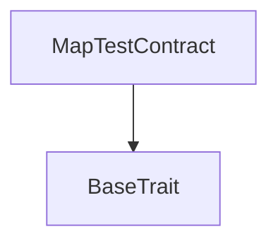
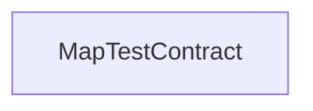

# Tact compilation report
Contract: MapTestContract
BoC Size: 22198 bytes

## Structures (Structs and Messages)
Total structures: 20

### DataSize
TL-B: `_ cells:int257 bits:int257 refs:int257 = DataSize`
Signature: `DataSize{cells:int257,bits:int257,refs:int257}`

### StateInit
TL-B: `_ code:^cell data:^cell = StateInit`
Signature: `StateInit{code:^cell,data:^cell}`

### Context
TL-B: `_ bounceable:bool sender:address value:int257 raw:^slice = Context`
Signature: `Context{bounceable:bool,sender:address,value:int257,raw:^slice}`

### SendParameters
TL-B: `_ mode:int257 body:Maybe ^cell code:Maybe ^cell data:Maybe ^cell value:int257 to:address bounce:bool = SendParameters`
Signature: `SendParameters{mode:int257,body:Maybe ^cell,code:Maybe ^cell,data:Maybe ^cell,value:int257,to:address,bounce:bool}`

### DeployParameters
TL-B: `_ mode:int257 body:Maybe ^cell value:int257 bounce:bool init:StateInit{code:^cell,data:^cell} = DeployParameters`
Signature: `DeployParameters{mode:int257,body:Maybe ^cell,value:int257,bounce:bool,init:StateInit{code:^cell,data:^cell}}`

### StdAddress
TL-B: `_ workchain:int8 address:uint256 = StdAddress`
Signature: `StdAddress{workchain:int8,address:uint256}`

### VarAddress
TL-B: `_ workchain:int32 address:^slice = VarAddress`
Signature: `VarAddress{workchain:int32,address:^slice}`

### SomeStruct
TL-B: `_ int:int257 bool:bool address:address a:int257 b:int257 = SomeStruct`
Signature: `SomeStruct{int:int257,bool:bool,address:address,a:int257,b:int257}`

### GetAllMapsResult
TL-B: `_ int_int:Maybe int257 int_int8:Maybe int257 int_int42:Maybe int257 int_int256:Maybe int257 int_uint8:Maybe int257 int_uint42:Maybe int257 int_uint256:Maybe int257 int_coins:Maybe int257 int8_int:Maybe int257 int8_int8:Maybe int257 int8_int42:Maybe int257 int8_int256:Maybe int257 int8_uint8:Maybe int257 int8_uint42:Maybe int257 int8_uint256:Maybe int257 int8_coins:Maybe int257 int42_int:Maybe int257 int42_int8:Maybe int257 int42_int42:Maybe int257 int42_int256:Maybe int257 int42_uint8:Maybe int257 int42_uint42:Maybe int257 int42_uint256:Maybe int257 int42_coins:Maybe int257 int256_int:Maybe int257 int256_int8:Maybe int257 int256_int42:Maybe int257 int256_int256:Maybe int257 int256_uint8:Maybe int257 int256_uint42:Maybe int257 int256_uint256:Maybe int257 int256_coins:Maybe int257 uint8_int:Maybe int257 uint8_int8:Maybe int257 uint8_int42:Maybe int257 uint8_int256:Maybe int257 uint8_uint8:Maybe int257 uint8_uint42:Maybe int257 uint8_uint256:Maybe int257 uint8_coins:Maybe int257 uint42_int:Maybe int257 uint42_int8:Maybe int257 uint42_int42:Maybe int257 uint42_int256:Maybe int257 uint42_uint8:Maybe int257 uint42_uint42:Maybe int257 uint42_uint256:Maybe int257 uint42_coins:Maybe int257 uint256_int:Maybe int257 uint256_int8:Maybe int257 uint256_int42:Maybe int257 uint256_int256:Maybe int257 uint256_uint8:Maybe int257 uint256_uint42:Maybe int257 uint256_uint256:Maybe int257 uint256_coins:Maybe int257 address_int:Maybe int257 address_int8:Maybe int257 address_int42:Maybe int257 address_int256:Maybe int257 address_uint8:Maybe int257 address_uint42:Maybe int257 address_uint256:Maybe int257 address_coins:Maybe int257 = GetAllMapsResult`
Signature: `GetAllMapsResult{int_int:Maybe int257,int_int8:Maybe int257,int_int42:Maybe int257,int_int256:Maybe int257,int_uint8:Maybe int257,int_uint42:Maybe int257,int_uint256:Maybe int257,int_coins:Maybe int257,int8_int:Maybe int257,int8_int8:Maybe int257,int8_int42:Maybe int257,int8_int256:Maybe int257,int8_uint8:Maybe int257,int8_uint42:Maybe int257,int8_uint256:Maybe int257,int8_coins:Maybe int257,int42_int:Maybe int257,int42_int8:Maybe int257,int42_int42:Maybe int257,int42_int256:Maybe int257,int42_uint8:Maybe int257,int42_uint42:Maybe int257,int42_uint256:Maybe int257,int42_coins:Maybe int257,int256_int:Maybe int257,int256_int8:Maybe int257,int256_int42:Maybe int257,int256_int256:Maybe int257,int256_uint8:Maybe int257,int256_uint42:Maybe int257,int256_uint256:Maybe int257,int256_coins:Maybe int257,uint8_int:Maybe int257,uint8_int8:Maybe int257,uint8_int42:Maybe int257,uint8_int256:Maybe int257,uint8_uint8:Maybe int257,uint8_uint42:Maybe int257,uint8_uint256:Maybe int257,uint8_coins:Maybe int257,uint42_int:Maybe int257,uint42_int8:Maybe int257,uint42_int42:Maybe int257,uint42_int256:Maybe int257,uint42_uint8:Maybe int257,uint42_uint42:Maybe int257,uint42_uint256:Maybe int257,uint42_coins:Maybe int257,uint256_int:Maybe int257,uint256_int8:Maybe int257,uint256_int42:Maybe int257,uint256_int256:Maybe int257,uint256_uint8:Maybe int257,uint256_uint42:Maybe int257,uint256_uint256:Maybe int257,uint256_coins:Maybe int257,address_int:Maybe int257,address_int8:Maybe int257,address_int42:Maybe int257,address_int256:Maybe int257,address_uint8:Maybe int257,address_uint42:Maybe int257,address_uint256:Maybe int257,address_coins:Maybe int257}`

### ReplaceAllMapsResult
TL-B: `_ int_int:bool int_int8:bool int_int42:bool int_int256:bool int_uint8:bool int_uint42:bool int_uint256:bool int_coins:bool int8_int:bool int8_int8:bool int8_int42:bool int8_int256:bool int8_uint8:bool int8_uint42:bool int8_uint256:bool int8_coins:bool int42_int:bool int42_int8:bool int42_int42:bool int42_int256:bool int42_uint8:bool int42_uint42:bool int42_uint256:bool int42_coins:bool int256_int:bool int256_int8:bool int256_int42:bool int256_int256:bool int256_uint8:bool int256_uint42:bool int256_uint256:bool int256_coins:bool uint8_int:bool uint8_int8:bool uint8_int42:bool uint8_int256:bool uint8_uint8:bool uint8_uint42:bool uint8_uint256:bool uint8_coins:bool uint42_int:bool uint42_int8:bool uint42_int42:bool uint42_int256:bool uint42_uint8:bool uint42_uint42:bool uint42_uint256:bool uint42_coins:bool uint256_int:bool uint256_int8:bool uint256_int42:bool uint256_int256:bool uint256_uint8:bool uint256_uint42:bool uint256_uint256:bool uint256_coins:bool address_int:bool address_int8:bool address_int42:bool address_int256:bool address_uint8:bool address_uint42:bool address_uint256:bool address_coins:bool = ReplaceAllMapsResult`
Signature: `ReplaceAllMapsResult{int_int:bool,int_int8:bool,int_int42:bool,int_int256:bool,int_uint8:bool,int_uint42:bool,int_uint256:bool,int_coins:bool,int8_int:bool,int8_int8:bool,int8_int42:bool,int8_int256:bool,int8_uint8:bool,int8_uint42:bool,int8_uint256:bool,int8_coins:bool,int42_int:bool,int42_int8:bool,int42_int42:bool,int42_int256:bool,int42_uint8:bool,int42_uint42:bool,int42_uint256:bool,int42_coins:bool,int256_int:bool,int256_int8:bool,int256_int42:bool,int256_int256:bool,int256_uint8:bool,int256_uint42:bool,int256_uint256:bool,int256_coins:bool,uint8_int:bool,uint8_int8:bool,uint8_int42:bool,uint8_int256:bool,uint8_uint8:bool,uint8_uint42:bool,uint8_uint256:bool,uint8_coins:bool,uint42_int:bool,uint42_int8:bool,uint42_int42:bool,uint42_int256:bool,uint42_uint8:bool,uint42_uint42:bool,uint42_uint256:bool,uint42_coins:bool,uint256_int:bool,uint256_int8:bool,uint256_int42:bool,uint256_int256:bool,uint256_uint8:bool,uint256_uint42:bool,uint256_uint256:bool,uint256_coins:bool,address_int:bool,address_int8:bool,address_int42:bool,address_int256:bool,address_uint8:bool,address_uint42:bool,address_uint256:bool,address_coins:bool}`

### ReplaceGetAllMapsResult
TL-B: `_ int_int:Maybe int257 int_int8:Maybe int257 int_int42:Maybe int257 int_int256:Maybe int257 int_uint8:Maybe int257 int_uint42:Maybe int257 int_uint256:Maybe int257 int_coins:Maybe int257 int8_int:Maybe int257 int8_int8:Maybe int257 int8_int42:Maybe int257 int8_int256:Maybe int257 int8_uint8:Maybe int257 int8_uint42:Maybe int257 int8_uint256:Maybe int257 int8_coins:Maybe int257 int42_int:Maybe int257 int42_int8:Maybe int257 int42_int42:Maybe int257 int42_int256:Maybe int257 int42_uint8:Maybe int257 int42_uint42:Maybe int257 int42_uint256:Maybe int257 int42_coins:Maybe int257 int256_int:Maybe int257 int256_int8:Maybe int257 int256_int42:Maybe int257 int256_int256:Maybe int257 int256_uint8:Maybe int257 int256_uint42:Maybe int257 int256_uint256:Maybe int257 int256_coins:Maybe int257 uint8_int:Maybe int257 uint8_int8:Maybe int257 uint8_int42:Maybe int257 uint8_int256:Maybe int257 uint8_uint8:Maybe int257 uint8_uint42:Maybe int257 uint8_uint256:Maybe int257 uint8_coins:Maybe int257 uint42_int:Maybe int257 uint42_int8:Maybe int257 uint42_int42:Maybe int257 uint42_int256:Maybe int257 uint42_uint8:Maybe int257 uint42_uint42:Maybe int257 uint42_uint256:Maybe int257 uint42_coins:Maybe int257 uint256_int:Maybe int257 uint256_int8:Maybe int257 uint256_int42:Maybe int257 uint256_int256:Maybe int257 uint256_uint8:Maybe int257 uint256_uint42:Maybe int257 uint256_uint256:Maybe int257 uint256_coins:Maybe int257 address_int:Maybe int257 address_int8:Maybe int257 address_int42:Maybe int257 address_int256:Maybe int257 address_uint8:Maybe int257 address_uint42:Maybe int257 address_uint256:Maybe int257 address_coins:Maybe int257 = ReplaceGetAllMapsResult`
Signature: `ReplaceGetAllMapsResult{int_int:Maybe int257,int_int8:Maybe int257,int_int42:Maybe int257,int_int256:Maybe int257,int_uint8:Maybe int257,int_uint42:Maybe int257,int_uint256:Maybe int257,int_coins:Maybe int257,int8_int:Maybe int257,int8_int8:Maybe int257,int8_int42:Maybe int257,int8_int256:Maybe int257,int8_uint8:Maybe int257,int8_uint42:Maybe int257,int8_uint256:Maybe int257,int8_coins:Maybe int257,int42_int:Maybe int257,int42_int8:Maybe int257,int42_int42:Maybe int257,int42_int256:Maybe int257,int42_uint8:Maybe int257,int42_uint42:Maybe int257,int42_uint256:Maybe int257,int42_coins:Maybe int257,int256_int:Maybe int257,int256_int8:Maybe int257,int256_int42:Maybe int257,int256_int256:Maybe int257,int256_uint8:Maybe int257,int256_uint42:Maybe int257,int256_uint256:Maybe int257,int256_coins:Maybe int257,uint8_int:Maybe int257,uint8_int8:Maybe int257,uint8_int42:Maybe int257,uint8_int256:Maybe int257,uint8_uint8:Maybe int257,uint8_uint42:Maybe int257,uint8_uint256:Maybe int257,uint8_coins:Maybe int257,uint42_int:Maybe int257,uint42_int8:Maybe int257,uint42_int42:Maybe int257,uint42_int256:Maybe int257,uint42_uint8:Maybe int257,uint42_uint42:Maybe int257,uint42_uint256:Maybe int257,uint42_coins:Maybe int257,uint256_int:Maybe int257,uint256_int8:Maybe int257,uint256_int42:Maybe int257,uint256_int256:Maybe int257,uint256_uint8:Maybe int257,uint256_uint42:Maybe int257,uint256_uint256:Maybe int257,uint256_coins:Maybe int257,address_int:Maybe int257,address_int8:Maybe int257,address_int42:Maybe int257,address_int256:Maybe int257,address_uint8:Maybe int257,address_uint42:Maybe int257,address_uint256:Maybe int257,address_coins:Maybe int257}`

### ExistsAllMapsResult
TL-B: `_ int_int:bool int_int8:bool int_int42:bool int_int256:bool int_uint8:bool int_uint42:bool int_uint256:bool int_coins:bool int8_int:bool int8_int8:bool int8_int42:bool int8_int256:bool int8_uint8:bool int8_uint42:bool int8_uint256:bool int8_coins:bool int42_int:bool int42_int8:bool int42_int42:bool int42_int256:bool int42_uint8:bool int42_uint42:bool int42_uint256:bool int42_coins:bool int256_int:bool int256_int8:bool int256_int42:bool int256_int256:bool int256_uint8:bool int256_uint42:bool int256_uint256:bool int256_coins:bool uint8_int:bool uint8_int8:bool uint8_int42:bool uint8_int256:bool uint8_uint8:bool uint8_uint42:bool uint8_uint256:bool uint8_coins:bool uint42_int:bool uint42_int8:bool uint42_int42:bool uint42_int256:bool uint42_uint8:bool uint42_uint42:bool uint42_uint256:bool uint42_coins:bool uint256_int:bool uint256_int8:bool uint256_int42:bool uint256_int256:bool uint256_uint8:bool uint256_uint42:bool uint256_uint256:bool uint256_coins:bool address_int:bool address_int8:bool address_int42:bool address_int256:bool address_uint8:bool address_uint42:bool address_uint256:bool address_coins:bool = ExistsAllMapsResult`
Signature: `ExistsAllMapsResult{int_int:bool,int_int8:bool,int_int42:bool,int_int256:bool,int_uint8:bool,int_uint42:bool,int_uint256:bool,int_coins:bool,int8_int:bool,int8_int8:bool,int8_int42:bool,int8_int256:bool,int8_uint8:bool,int8_uint42:bool,int8_uint256:bool,int8_coins:bool,int42_int:bool,int42_int8:bool,int42_int42:bool,int42_int256:bool,int42_uint8:bool,int42_uint42:bool,int42_uint256:bool,int42_coins:bool,int256_int:bool,int256_int8:bool,int256_int42:bool,int256_int256:bool,int256_uint8:bool,int256_uint42:bool,int256_uint256:bool,int256_coins:bool,uint8_int:bool,uint8_int8:bool,uint8_int42:bool,uint8_int256:bool,uint8_uint8:bool,uint8_uint42:bool,uint8_uint256:bool,uint8_coins:bool,uint42_int:bool,uint42_int8:bool,uint42_int42:bool,uint42_int256:bool,uint42_uint8:bool,uint42_uint42:bool,uint42_uint256:bool,uint42_coins:bool,uint256_int:bool,uint256_int8:bool,uint256_int42:bool,uint256_int256:bool,uint256_uint8:bool,uint256_uint42:bool,uint256_uint256:bool,uint256_coins:bool,address_int:bool,address_int8:bool,address_int42:bool,address_int256:bool,address_uint8:bool,address_uint42:bool,address_uint256:bool,address_coins:bool}`

### IsEmptyAllMapsResult
TL-B: `_ int_int:bool int_int8:bool int_int42:bool int_int256:bool int_uint8:bool int_uint42:bool int_uint256:bool int_coins:bool int8_int:bool int8_int8:bool int8_int42:bool int8_int256:bool int8_uint8:bool int8_uint42:bool int8_uint256:bool int8_coins:bool int42_int:bool int42_int8:bool int42_int42:bool int42_int256:bool int42_uint8:bool int42_uint42:bool int42_uint256:bool int42_coins:bool int256_int:bool int256_int8:bool int256_int42:bool int256_int256:bool int256_uint8:bool int256_uint42:bool int256_uint256:bool int256_coins:bool uint8_int:bool uint8_int8:bool uint8_int42:bool uint8_int256:bool uint8_uint8:bool uint8_uint42:bool uint8_uint256:bool uint8_coins:bool uint42_int:bool uint42_int8:bool uint42_int42:bool uint42_int256:bool uint42_uint8:bool uint42_uint42:bool uint42_uint256:bool uint42_coins:bool uint256_int:bool uint256_int8:bool uint256_int42:bool uint256_int256:bool uint256_uint8:bool uint256_uint42:bool uint256_uint256:bool uint256_coins:bool address_int:bool address_int8:bool address_int42:bool address_int256:bool address_uint8:bool address_uint42:bool address_uint256:bool address_coins:bool = IsEmptyAllMapsResult`
Signature: `IsEmptyAllMapsResult{int_int:bool,int_int8:bool,int_int42:bool,int_int256:bool,int_uint8:bool,int_uint42:bool,int_uint256:bool,int_coins:bool,int8_int:bool,int8_int8:bool,int8_int42:bool,int8_int256:bool,int8_uint8:bool,int8_uint42:bool,int8_uint256:bool,int8_coins:bool,int42_int:bool,int42_int8:bool,int42_int42:bool,int42_int256:bool,int42_uint8:bool,int42_uint42:bool,int42_uint256:bool,int42_coins:bool,int256_int:bool,int256_int8:bool,int256_int42:bool,int256_int256:bool,int256_uint8:bool,int256_uint42:bool,int256_uint256:bool,int256_coins:bool,uint8_int:bool,uint8_int8:bool,uint8_int42:bool,uint8_int256:bool,uint8_uint8:bool,uint8_uint42:bool,uint8_uint256:bool,uint8_coins:bool,uint42_int:bool,uint42_int8:bool,uint42_int42:bool,uint42_int256:bool,uint42_uint8:bool,uint42_uint42:bool,uint42_uint256:bool,uint42_coins:bool,uint256_int:bool,uint256_int8:bool,uint256_int42:bool,uint256_int256:bool,uint256_uint8:bool,uint256_uint42:bool,uint256_uint256:bool,uint256_coins:bool,address_int:bool,address_int8:bool,address_int42:bool,address_int256:bool,address_uint8:bool,address_uint42:bool,address_uint256:bool,address_coins:bool}`

### AsCellAllMapsResult
TL-B: `_ int_int:Maybe ^cell int_int8:Maybe ^cell int_int42:Maybe ^cell int_int256:Maybe ^cell int_uint8:Maybe ^cell int_uint42:Maybe ^cell int_uint256:Maybe ^cell int_coins:Maybe ^cell int8_int:Maybe ^cell int8_int8:Maybe ^cell int8_int42:Maybe ^cell int8_int256:Maybe ^cell int8_uint8:Maybe ^cell int8_uint42:Maybe ^cell int8_uint256:Maybe ^cell int8_coins:Maybe ^cell int42_int:Maybe ^cell int42_int8:Maybe ^cell int42_int42:Maybe ^cell int42_int256:Maybe ^cell int42_uint8:Maybe ^cell int42_uint42:Maybe ^cell int42_uint256:Maybe ^cell int42_coins:Maybe ^cell int256_int:Maybe ^cell int256_int8:Maybe ^cell int256_int42:Maybe ^cell int256_int256:Maybe ^cell int256_uint8:Maybe ^cell int256_uint42:Maybe ^cell int256_uint256:Maybe ^cell int256_coins:Maybe ^cell uint8_int:Maybe ^cell uint8_int8:Maybe ^cell uint8_int42:Maybe ^cell uint8_int256:Maybe ^cell uint8_uint8:Maybe ^cell uint8_uint42:Maybe ^cell uint8_uint256:Maybe ^cell uint8_coins:Maybe ^cell uint42_int:Maybe ^cell uint42_int8:Maybe ^cell uint42_int42:Maybe ^cell uint42_int256:Maybe ^cell uint42_uint8:Maybe ^cell uint42_uint42:Maybe ^cell uint42_uint256:Maybe ^cell uint42_coins:Maybe ^cell uint256_int:Maybe ^cell uint256_int8:Maybe ^cell uint256_int42:Maybe ^cell uint256_int256:Maybe ^cell uint256_uint8:Maybe ^cell uint256_uint42:Maybe ^cell uint256_uint256:Maybe ^cell uint256_coins:Maybe ^cell address_int:Maybe ^cell address_int8:Maybe ^cell address_int42:Maybe ^cell address_int256:Maybe ^cell address_uint8:Maybe ^cell address_uint42:Maybe ^cell address_uint256:Maybe ^cell address_coins:Maybe ^cell = AsCellAllMapsResult`
Signature: `AsCellAllMapsResult{int_int:Maybe ^cell,int_int8:Maybe ^cell,int_int42:Maybe ^cell,int_int256:Maybe ^cell,int_uint8:Maybe ^cell,int_uint42:Maybe ^cell,int_uint256:Maybe ^cell,int_coins:Maybe ^cell,int8_int:Maybe ^cell,int8_int8:Maybe ^cell,int8_int42:Maybe ^cell,int8_int256:Maybe ^cell,int8_uint8:Maybe ^cell,int8_uint42:Maybe ^cell,int8_uint256:Maybe ^cell,int8_coins:Maybe ^cell,int42_int:Maybe ^cell,int42_int8:Maybe ^cell,int42_int42:Maybe ^cell,int42_int256:Maybe ^cell,int42_uint8:Maybe ^cell,int42_uint42:Maybe ^cell,int42_uint256:Maybe ^cell,int42_coins:Maybe ^cell,int256_int:Maybe ^cell,int256_int8:Maybe ^cell,int256_int42:Maybe ^cell,int256_int256:Maybe ^cell,int256_uint8:Maybe ^cell,int256_uint42:Maybe ^cell,int256_uint256:Maybe ^cell,int256_coins:Maybe ^cell,uint8_int:Maybe ^cell,uint8_int8:Maybe ^cell,uint8_int42:Maybe ^cell,uint8_int256:Maybe ^cell,uint8_uint8:Maybe ^cell,uint8_uint42:Maybe ^cell,uint8_uint256:Maybe ^cell,uint8_coins:Maybe ^cell,uint42_int:Maybe ^cell,uint42_int8:Maybe ^cell,uint42_int42:Maybe ^cell,uint42_int256:Maybe ^cell,uint42_uint8:Maybe ^cell,uint42_uint42:Maybe ^cell,uint42_uint256:Maybe ^cell,uint42_coins:Maybe ^cell,uint256_int:Maybe ^cell,uint256_int8:Maybe ^cell,uint256_int42:Maybe ^cell,uint256_int256:Maybe ^cell,uint256_uint8:Maybe ^cell,uint256_uint42:Maybe ^cell,uint256_uint256:Maybe ^cell,uint256_coins:Maybe ^cell,address_int:Maybe ^cell,address_int8:Maybe ^cell,address_int42:Maybe ^cell,address_int256:Maybe ^cell,address_uint8:Maybe ^cell,address_uint42:Maybe ^cell,address_uint256:Maybe ^cell,address_coins:Maybe ^cell}`

### SetAllMaps
TL-B: `set_all_maps#51f18191 keyInt:int257 keyInt8:int257 keyInt42:int257 keyInt256:int257 keyUint8:int257 keyUint42:int257 keyUint256:int257 keyAddress:address valueInt:Maybe int257 valueInt8:Maybe int257 valueInt42:Maybe int257 valueInt256:Maybe int257 valueUint8:Maybe int257 valueUint42:Maybe int257 valueUint256:Maybe int257 valueCoins:Maybe int257 = SetAllMaps`
Signature: `SetAllMaps{keyInt:int257,keyInt8:int257,keyInt42:int257,keyInt256:int257,keyUint8:int257,keyUint42:int257,keyUint256:int257,keyAddress:address,valueInt:Maybe int257,valueInt8:Maybe int257,valueInt42:Maybe int257,valueInt256:Maybe int257,valueUint8:Maybe int257,valueUint42:Maybe int257,valueUint256:Maybe int257,valueCoins:Maybe int257}`

### DelAllMaps
TL-B: `del_all_maps#4b2bbe7f keyInt:int257 keyInt8:int257 keyInt42:int257 keyInt256:int257 keyUint8:int257 keyUint42:int257 keyUint256:int257 keyAddress:address = DelAllMaps`
Signature: `DelAllMaps{keyInt:int257,keyInt8:int257,keyInt42:int257,keyInt256:int257,keyUint8:int257,keyUint42:int257,keyUint256:int257,keyAddress:address}`

### ReplaceAllMaps
TL-B: `replace_all_maps#9f15cd96 keyInt:int257 keyInt8:int257 keyInt42:int257 keyInt256:int257 keyUint8:int257 keyUint42:int257 keyUint256:int257 keyAddress:address valueInt:Maybe int257 valueInt8:Maybe int257 valueInt42:Maybe int257 valueInt256:Maybe int257 valueUint8:Maybe int257 valueUint42:Maybe int257 valueUint256:Maybe int257 valueCoins:Maybe int257 = ReplaceAllMaps`
Signature: `ReplaceAllMaps{keyInt:int257,keyInt8:int257,keyInt42:int257,keyInt256:int257,keyUint8:int257,keyUint42:int257,keyUint256:int257,keyAddress:address,valueInt:Maybe int257,valueInt8:Maybe int257,valueInt42:Maybe int257,valueInt256:Maybe int257,valueUint8:Maybe int257,valueUint42:Maybe int257,valueUint256:Maybe int257,valueCoins:Maybe int257}`

### ReplaceGetAllMaps
TL-B: `replace_get_all_maps#cc16c9da keyInt:int257 keyInt8:int257 keyInt42:int257 keyInt256:int257 keyUint8:int257 keyUint42:int257 keyUint256:int257 keyAddress:address valueInt:Maybe int257 valueInt8:Maybe int257 valueInt42:Maybe int257 valueInt256:Maybe int257 valueUint8:Maybe int257 valueUint42:Maybe int257 valueUint256:Maybe int257 valueCoins:Maybe int257 = ReplaceGetAllMaps`
Signature: `ReplaceGetAllMaps{keyInt:int257,keyInt8:int257,keyInt42:int257,keyInt256:int257,keyUint8:int257,keyUint42:int257,keyUint256:int257,keyAddress:address,valueInt:Maybe int257,valueInt8:Maybe int257,valueInt42:Maybe int257,valueInt256:Maybe int257,valueUint8:Maybe int257,valueUint42:Maybe int257,valueUint256:Maybe int257,valueCoins:Maybe int257}`

### CheckNullReference
TL-B: `check_null_reference#b182fee0  = CheckNullReference`
Signature: `CheckNullReference{}`

### MapTestContract$Data
TL-B: `null`
Signature: `null`

## Get methods
Total get methods: 8

## allMaps
No arguments

## getAllMaps
Argument: keyInt
Argument: keyInt8
Argument: keyInt42
Argument: keyInt256
Argument: keyUint8
Argument: keyUint42
Argument: keyUint256
Argument: keyAddress

## replaceAllMaps
Argument: keyInt
Argument: keyInt8
Argument: keyInt42
Argument: keyInt256
Argument: keyUint8
Argument: keyUint42
Argument: keyUint256
Argument: keyAddress
Argument: valueInt
Argument: valueInt8
Argument: valueInt42
Argument: valueInt256
Argument: valueUint8
Argument: valueUint42
Argument: valueUint256
Argument: valueCoins

## replaceGetAllMaps
Argument: keyInt
Argument: keyInt8
Argument: keyInt42
Argument: keyInt256
Argument: keyUint8
Argument: keyUint42
Argument: keyUint256
Argument: keyAddress
Argument: valueInt
Argument: valueInt8
Argument: valueInt42
Argument: valueInt256
Argument: valueUint8
Argument: valueUint42
Argument: valueUint256
Argument: valueCoins

## existsAllMaps
Argument: keyInt
Argument: keyInt8
Argument: keyInt42
Argument: keyInt256
Argument: keyUint8
Argument: keyUint42
Argument: keyUint256
Argument: keyAddress

## isEmptyAllMaps
No arguments

## asCellAllMaps
No arguments

## checkNullReference
No arguments

## Exit codes
* 2: Stack underflow
* 3: Stack overflow
* 4: Integer overflow
* 5: Integer out of expected range
* 6: Invalid opcode
* 7: Type check error
* 8: Cell overflow
* 9: Cell underflow
* 10: Dictionary error
* 11: 'Unknown' error
* 12: Fatal error
* 13: Out of gas error
* 14: Virtualization error
* 32: Action list is invalid
* 33: Action list is too long
* 34: Action is invalid or not supported
* 35: Invalid source address in outbound message
* 36: Invalid destination address in outbound message
* 37: Not enough Toncoin
* 38: Not enough extra currencies
* 39: Outbound message does not fit into a cell after rewriting
* 40: Cannot process a message
* 41: Library reference is null
* 42: Library change action error
* 43: Exceeded maximum number of cells in the library or the maximum depth of the Merkle tree
* 50: Account state size exceeded limits
* 128: Null reference exception
* 129: Invalid serialization prefix
* 130: Invalid incoming message
* 131: Constraints error
* 132: Access denied
* 133: Contract stopped
* 134: Invalid argument
* 135: Code of a contract was not found
* 136: Invalid standard address

## Trait inheritance diagram

## Contract dependency diagram

