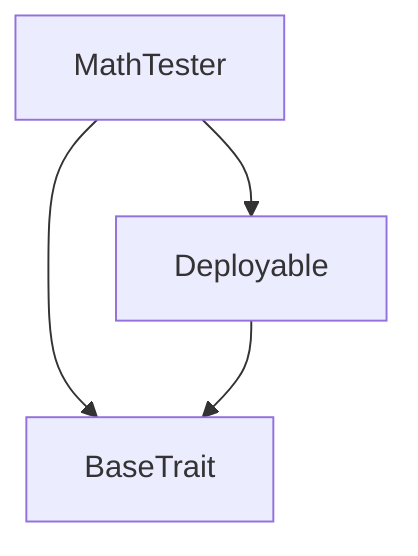
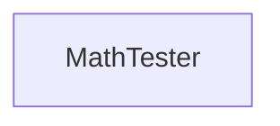

# Tact compilation report
Contract: MathTester
BoC Size: 3094 bytes

## Structures (Structs and Messages)
Total structures: 11

### DataSize
TL-B: `_ cells:int257 bits:int257 refs:int257 = DataSize`
Signature: `DataSize{cells:int257,bits:int257,refs:int257}`

### StateInit
TL-B: `_ code:^cell data:^cell = StateInit`
Signature: `StateInit{code:^cell,data:^cell}`

### Context
TL-B: `_ bounceable:bool sender:address value:int257 raw:^slice = Context`
Signature: `Context{bounceable:bool,sender:address,value:int257,raw:^slice}`

### SendParameters
TL-B: `_ mode:int257 body:Maybe ^cell code:Maybe ^cell data:Maybe ^cell value:int257 to:address bounce:bool = SendParameters`
Signature: `SendParameters{mode:int257,body:Maybe ^cell,code:Maybe ^cell,data:Maybe ^cell,value:int257,to:address,bounce:bool}`

### DeployParameters
TL-B: `_ mode:int257 body:Maybe ^cell value:int257 bounce:bool init:StateInit{code:^cell,data:^cell} = DeployParameters`
Signature: `DeployParameters{mode:int257,body:Maybe ^cell,value:int257,bounce:bool,init:StateInit{code:^cell,data:^cell}}`

### StdAddress
TL-B: `_ workchain:int8 address:uint256 = StdAddress`
Signature: `StdAddress{workchain:int8,address:uint256}`

### VarAddress
TL-B: `_ workchain:int32 address:^slice = VarAddress`
Signature: `VarAddress{workchain:int32,address:^slice}`

### Deploy
TL-B: `deploy#946a98b6 queryId:uint64 = Deploy`
Signature: `Deploy{queryId:uint64}`

### DeployOk
TL-B: `deploy_ok#aff90f57 queryId:uint64 = DeployOk`
Signature: `DeployOk{queryId:uint64}`

### FactoryDeploy
TL-B: `factory_deploy#6d0ff13b queryId:uint64 cashback:address = FactoryDeploy`
Signature: `FactoryDeploy{queryId:uint64,cashback:address}`

### MathTester$Data
TL-B: `null`
Signature: `null`

## Get methods
Total get methods: 102

## add
Argument: a
Argument: b

## sub
Argument: a
Argument: b

## mul
Argument: a
Argument: b

## div
Argument: a
Argument: b

## mod
Argument: a
Argument: b

## shr
Argument: a
Argument: b

## shl
Argument: a
Argument: b

## and
Argument: a
Argument: b

## or
Argument: a
Argument: b

## xor
Argument: a
Argument: b

## bitwise_not
Argument: a

## addAug
Argument: a
Argument: b

## subAug
Argument: a
Argument: b

## mulAug
Argument: a
Argument: b

## divAug
Argument: a
Argument: b

## modAug
Argument: a
Argument: b

## bitwiseOrAug
Argument: a
Argument: b

## bitwiseAndAug
Argument: a
Argument: b

## bitwiseXorAug
Argument: a
Argument: b

## compare1
Argument: a
Argument: b

## compare2
Argument: a
Argument: b

## compare3
Argument: a
Argument: b

## compare4
Argument: a
Argument: b

## compare5
Argument: a
Argument: b

## compare6
Argument: a
Argument: b

## compare7
Argument: a
Argument: b

## compare8
Argument: a
Argument: b

## compare9
Argument: a
Argument: b

## compare10
Argument: a
Argument: b

## compare11
Argument: a
Argument: b

## compare12
Argument: a
Argument: b

## compare13
Argument: a
Argument: b

## compare14
Argument: a
Argument: b

## compare15
Argument: a
Argument: b

## compare16
Argument: a
Argument: b

## compare17
Argument: a
Argument: b

## compare18
Argument: a
Argument: b

## compare19
Argument: a
Argument: b

## compare20
Argument: a
Argument: b

## compare21
Argument: a
Argument: b

## compare22
Argument: a
Argument: b

## compare23
Argument: a
Argument: b

## compare24
Argument: a
Argument: b

## compare25
Argument: a
Argument: b

## compare26
Argument: a
Argument: b

## compare27
Argument: a
Argument: b

## compare28
Argument: a
Argument: b

## compare29
Argument: a
Argument: b

## compare30
Argument: a
Argument: b

## compare31
Argument: a
Argument: b

## compare32
Argument: a
Argument: b

## compare33
Argument: a
Argument: b

## compare34
Argument: a
Argument: b

## compare35
Argument: a
Argument: b

## compare36
Argument: a
Argument: b

## compare37
Argument: a
Argument: b

## compare38
Argument: a
Argument: b

## compare39
Argument: a
Argument: b

## compare40
Argument: a
Argument: b

## compare41
Argument: a
Argument: b

## compare42
Argument: a
Argument: b

## compare43
Argument: a
Argument: b

## compare44
Argument: a
Argument: b

## isNull1
Argument: a

## isNotNull1
Argument: a

## isNull2
Argument: address

## isNotNull2
Argument: address

## isNull3
Argument: cell

## isNotNull3
Argument: cell

## log2
Argument: num

## log
Argument: num
Argument: base

## pow
Argument: base
Argument: exp

## pow2
Argument: exp

## precedence1
No arguments

## precedence2
No arguments

## precedence3
No arguments

## precedence4
No arguments

## precedence5
No arguments

## precedence6
No arguments

## precedence7
No arguments

## precedence8
No arguments

## precedence9
No arguments

## precedence10
No arguments

## precedence11
No arguments

## precedence12
No arguments

## bitwiseNot1
Argument: x

## bitwiseNot2
Argument: x

## bitwiseNot3
Argument: x

## bitwiseNot4
Argument: x

## augmentedAnd
Argument: a
Argument: b

## augmentedOr
Argument: a
Argument: b

## augmentedShiftLeft
Argument: a
Argument: b

## augmentedShiftRight
Argument: a
Argument: b

## shiftLeft0
Argument: i

## shiftRight0
Argument: i

## sign
Argument: x

## divc
Argument: x
Argument: y

## muldivc
Argument: x
Argument: y
Argument: z

## mulShiftRight
Argument: x
Argument: y
Argument: z

## mulShiftRightRound
Argument: x
Argument: y
Argument: z

## mulShiftRightCeil
Argument: x
Argument: y
Argument: z

## sqrt
Argument: x

## Exit codes
* 2: Stack underflow
* 3: Stack overflow
* 4: Integer overflow
* 5: Integer out of expected range
* 6: Invalid opcode
* 7: Type check error
* 8: Cell overflow
* 9: Cell underflow
* 10: Dictionary error
* 11: 'Unknown' error
* 12: Fatal error
* 13: Out of gas error
* 14: Virtualization error
* 32: Action list is invalid
* 33: Action list is too long
* 34: Action is invalid or not supported
* 35: Invalid source address in outbound message
* 36: Invalid destination address in outbound message
* 37: Not enough Toncoin
* 38: Not enough extra currencies
* 39: Outbound message does not fit into a cell after rewriting
* 40: Cannot process a message
* 41: Library reference is null
* 42: Library change action error
* 43: Exceeded maximum number of cells in the library or the maximum depth of the Merkle tree
* 50: Account state size exceeded limits
* 128: Null reference exception
* 129: Invalid serialization prefix
* 130: Invalid incoming message
* 131: Constraints error
* 132: Access denied
* 133: Contract stopped
* 134: Invalid argument
* 135: Code of a contract was not found
* 136: Invalid standard address

## Trait inheritance diagram

## Contract dependency diagram

