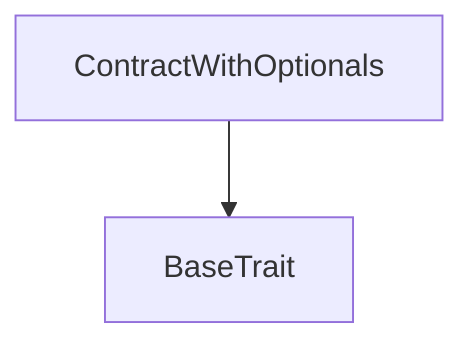

# Tact compilation report
Contract: ContractWithOptionals
BoC Size: 1364 bytes

## Structures (Structs and Messages)
Total structures: 19

### DataSize
TL-B: `_ cells:int257 bits:int257 refs:int257 = DataSize`
Signature: `DataSize{cells:int257,bits:int257,refs:int257}`

### StateInit
TL-B: `_ code:^cell data:^cell = StateInit`
Signature: `StateInit{code:^cell,data:^cell}`

### Context
TL-B: `_ bounceable:bool sender:address value:int257 raw:^slice = Context`
Signature: `Context{bounceable:bool,sender:address,value:int257,raw:^slice}`

### SendParameters
TL-B: `_ mode:int257 body:Maybe ^cell code:Maybe ^cell data:Maybe ^cell value:int257 to:address bounce:bool = SendParameters`
Signature: `SendParameters{mode:int257,body:Maybe ^cell,code:Maybe ^cell,data:Maybe ^cell,value:int257,to:address,bounce:bool}`

### MessageParameters
TL-B: `_ mode:int257 body:Maybe ^cell value:int257 to:address bounce:bool = MessageParameters`
Signature: `MessageParameters{mode:int257,body:Maybe ^cell,value:int257,to:address,bounce:bool}`

### DeployParameters
TL-B: `_ mode:int257 body:Maybe ^cell value:int257 bounce:bool init:StateInit{code:^cell,data:^cell} = DeployParameters`
Signature: `DeployParameters{mode:int257,body:Maybe ^cell,value:int257,bounce:bool,init:StateInit{code:^cell,data:^cell}}`

### StdAddress
TL-B: `_ workchain:int8 address:uint256 = StdAddress`
Signature: `StdAddress{workchain:int8,address:uint256}`

### VarAddress
TL-B: `_ workchain:int32 address:^slice = VarAddress`
Signature: `VarAddress{workchain:int32,address:^slice}`

### BasechainAddress
TL-B: `_ hash:Maybe int257 = BasechainAddress`
Signature: `BasechainAddress{hash:Maybe int257}`

### Struct2
TL-B: `struct2#b119629a v:int257 = Struct2`
Signature: `Struct2{v:int257}`

### OptStruct
TL-B: `_ s:Maybe Struct2{v:int257} = OptStruct`
Signature: `OptStruct{s:Maybe Struct2{v:int257}}`

### Opt2$Data
TL-B: `_ stateInit:StateInit{code:^cell,data:^cell} = Opt2`
Signature: `Opt2{stateInit:StateInit{code:^cell,data:^cell}}`

### Opt3$Data
TL-B: `_  = Opt3`
Signature: `Opt3{}`

### OptAddr
TL-B: `opt_addr#c7e9e464 x:uint8 y:Maybe address z:uint16 = OptAddr`
Signature: `OptAddr{x:uint8,y:Maybe address,z:uint16}`

### Opt4$Data
TL-B: `_ z:int257 = Opt4`
Signature: `Opt4{z:int257}`

### SomeGenericStruct
TL-B: `_ value1:int257 value2:int257 value3:int257 value4:int257 value5:int257 = SomeGenericStruct`
Signature: `SomeGenericStruct{value1:int257,value2:int257,value3:int257,value4:int257,value5:int257}`

### StructWithOptionals
TL-B: `_ a:Maybe int257 b:Maybe bool c:Maybe ^cell d:Maybe address e:Maybe SomeGenericStruct{value1:int257,value2:int257,value3:int257,value4:int257,value5:int257} = StructWithOptionals`
Signature: `StructWithOptionals{a:Maybe int257,b:Maybe bool,c:Maybe ^cell,d:Maybe address,e:Maybe SomeGenericStruct{value1:int257,value2:int257,value3:int257,value4:int257,value5:int257}}`

### Update
TL-B: `update#1554fcfd a:Maybe int257 b:Maybe bool c:Maybe ^cell d:Maybe address e:Maybe SomeGenericStruct{value1:int257,value2:int257,value3:int257,value4:int257,value5:int257} f:Maybe StructWithOptionals{a:Maybe int257,b:Maybe bool,c:Maybe ^cell,d:Maybe address,e:Maybe SomeGenericStruct{value1:int257,value2:int257,value3:int257,value4:int257,value5:int257}} = Update`
Signature: `Update{a:Maybe int257,b:Maybe bool,c:Maybe ^cell,d:Maybe address,e:Maybe SomeGenericStruct{value1:int257,value2:int257,value3:int257,value4:int257,value5:int257},f:Maybe StructWithOptionals{a:Maybe int257,b:Maybe bool,c:Maybe ^cell,d:Maybe address,e:Maybe SomeGenericStruct{value1:int257,value2:int257,value3:int257,value4:int257,value5:int257}}}`

### ContractWithOptionals$Data
TL-B: `_ a:Maybe int257 b:Maybe bool c:Maybe ^cell d:Maybe address e:Maybe SomeGenericStruct{value1:int257,value2:int257,value3:int257,value4:int257,value5:int257} f:Maybe StructWithOptionals{a:Maybe int257,b:Maybe bool,c:Maybe ^cell,d:Maybe address,e:Maybe SomeGenericStruct{value1:int257,value2:int257,value3:int257,value4:int257,value5:int257}} = ContractWithOptionals`
Signature: `ContractWithOptionals{a:Maybe int257,b:Maybe bool,c:Maybe ^cell,d:Maybe address,e:Maybe SomeGenericStruct{value1:int257,value2:int257,value3:int257,value4:int257,value5:int257},f:Maybe StructWithOptionals{a:Maybe int257,b:Maybe bool,c:Maybe ^cell,d:Maybe address,e:Maybe SomeGenericStruct{value1:int257,value2:int257,value3:int257,value4:int257,value5:int257}}}`

## Get methods
Total get methods: 19

## isNotNullA
No arguments

## isNotNullB
No arguments

## isNotNullC
No arguments

## isNotNullD
No arguments

## isNotNullE
No arguments

## isNotNullF
No arguments

## nullA
No arguments

## nullB
No arguments

## nullC
No arguments

## nullD
No arguments

## nullE
No arguments

## nullF
No arguments

## notNullA
No arguments

## notNullB
No arguments

## notNullC
No arguments

## notNullD
No arguments

## notNullE
No arguments

## notNullF
No arguments

## testVariables
No arguments

## Exit codes
* 2: Stack underflow
* 3: Stack overflow
* 4: Integer overflow
* 5: Integer out of expected range
* 6: Invalid opcode
* 7: Type check error
* 8: Cell overflow
* 9: Cell underflow
* 10: Dictionary error
* 11: 'Unknown' error
* 12: Fatal error
* 13: Out of gas error
* 14: Virtualization error
* 32: Action list is invalid
* 33: Action list is too long
* 34: Action is invalid or not supported
* 35: Invalid source address in outbound message
* 36: Invalid destination address in outbound message
* 37: Not enough Toncoin
* 38: Not enough extra currencies
* 39: Outbound message does not fit into a cell after rewriting
* 40: Cannot process a message
* 41: Library reference is null
* 42: Library change action error
* 43: Exceeded maximum number of cells in the library or the maximum depth of the Merkle tree
* 50: Account state size exceeded limits
* 128: Null reference exception
* 129: Invalid serialization prefix
* 130: Invalid incoming message
* 131: Constraints error
* 132: Access denied
* 133: Contract stopped
* 134: Invalid argument
* 135: Code of a contract was not found
* 136: Invalid standard address

## Trait inheritance diagram

## Contract dependency diagram

