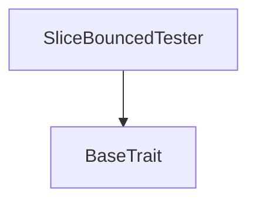

# Tact compilation report
Contract: SliceBouncedTester
BoC Size: 323 bytes

## Structures (Structs and Messages)
Total structures: 52

### DataSize
TL-B: `_ cells:int257 bits:int257 refs:int257 = DataSize`
Signature: `DataSize{cells:int257,bits:int257,refs:int257}`

### StateInit
TL-B: `_ code:^cell data:^cell = StateInit`
Signature: `StateInit{code:^cell,data:^cell}`

### Context
TL-B: `_ bounceable:bool sender:address value:int257 raw:^slice = Context`
Signature: `Context{bounceable:bool,sender:address,value:int257,raw:^slice}`

### SendParameters
TL-B: `_ mode:int257 body:Maybe ^cell code:Maybe ^cell data:Maybe ^cell value:int257 to:address bounce:bool = SendParameters`
Signature: `SendParameters{mode:int257,body:Maybe ^cell,code:Maybe ^cell,data:Maybe ^cell,value:int257,to:address,bounce:bool}`

### MessageParameters
TL-B: `_ mode:int257 body:Maybe ^cell value:int257 to:address bounce:bool = MessageParameters`
Signature: `MessageParameters{mode:int257,body:Maybe ^cell,value:int257,to:address,bounce:bool}`

### DeployParameters
TL-B: `_ mode:int257 body:Maybe ^cell value:int257 bounce:bool init:StateInit{code:^cell,data:^cell} = DeployParameters`
Signature: `DeployParameters{mode:int257,body:Maybe ^cell,value:int257,bounce:bool,init:StateInit{code:^cell,data:^cell}}`

### StdAddress
TL-B: `_ workchain:int8 address:uint256 = StdAddress`
Signature: `StdAddress{workchain:int8,address:uint256}`

### VarAddress
TL-B: `_ workchain:int32 address:^slice = VarAddress`
Signature: `VarAddress{workchain:int32,address:^slice}`

### BasechainAddress
TL-B: `_ hash:Maybe int257 = BasechainAddress`
Signature: `BasechainAddress{hash:Maybe int257}`

### Message
TL-B: `message#00000064 msg:^string = Message`
Signature: `Message{msg:^string}`

### Empty
TL-B: `empty#00000065  = Empty`
Signature: `Empty{}`

### BinaryIntOperation
TL-B: `binary_int_operation#3177103a op:^string val1:int257 val2:int257 = BinaryIntOperation`
Signature: `BinaryIntOperation{op:^string,val1:int257,val2:int257}`

### BinaryIntResult
TL-B: `binary_int_result#fc632810 val:int257 = BinaryIntResult`
Signature: `BinaryIntResult{val:int257}`

### SendCellToAddress
TL-B: `send_cell_to_address#7f9e1f09 address:address body:^cell = SendCellToAddress`
Signature: `SendCellToAddress{address:address,body:^cell}`

### Calculator$Data
TL-B: `_  = Calculator`
Signature: `Calculator{}`

### ReceiverTester$Data
TL-B: `_ receiverKind:^string = ReceiverTester`
Signature: `ReceiverTester{receiverKind:^string}`

### NoReceiverTester$Data
TL-B: `_ receiver:^string = NoReceiverTester`
Signature: `NoReceiverTester{receiver:^string}`

### EmptyReceiverTester$Data
TL-B: `_ receiver:^string = EmptyReceiverTester`
Signature: `EmptyReceiverTester{receiver:^string}`

### CommentReceiverTester$Data
TL-B: `_ receiver:^string = CommentReceiverTester`
Signature: `CommentReceiverTester{receiver:^string}`

### StringReceiverTester$Data
TL-B: `_ receiver:^string = StringReceiverTester`
Signature: `StringReceiverTester{receiver:^string}`

### BinaryReceiverTester$Data
TL-B: `_ receiver:^string = BinaryReceiverTester`
Signature: `BinaryReceiverTester{receiver:^string}`

### SliceReceiverTester$Data
TL-B: `_ receiver:^string = SliceReceiverTester`
Signature: `SliceReceiverTester{receiver:^string}`

### EmptyAndCommentReceiverTester$Data
TL-B: `_ receiver:^string = EmptyAndCommentReceiverTester`
Signature: `EmptyAndCommentReceiverTester{receiver:^string}`

### EmptyAndStringReceiverTester$Data
TL-B: `_ receiver:^string = EmptyAndStringReceiverTester`
Signature: `EmptyAndStringReceiverTester{receiver:^string}`

### EmptyAndBinaryReceiverTester$Data
TL-B: `_ receiver:^string = EmptyAndBinaryReceiverTester`
Signature: `EmptyAndBinaryReceiverTester{receiver:^string}`

### EmptyAndSliceReceiverTester$Data
TL-B: `_ receiver:^string = EmptyAndSliceReceiverTester`
Signature: `EmptyAndSliceReceiverTester{receiver:^string}`

### CommentAndStringReceiverTester$Data
TL-B: `_ receiver:^string = CommentAndStringReceiverTester`
Signature: `CommentAndStringReceiverTester{receiver:^string}`

### CommentAndBinaryReceiverTester$Data
TL-B: `_ receiver:^string = CommentAndBinaryReceiverTester`
Signature: `CommentAndBinaryReceiverTester{receiver:^string}`

### CommentAndSliceReceiverTester$Data
TL-B: `_ receiver:^string = CommentAndSliceReceiverTester`
Signature: `CommentAndSliceReceiverTester{receiver:^string}`

### StringAndBinaryReceiverTester$Data
TL-B: `_ receiver:^string = StringAndBinaryReceiverTester`
Signature: `StringAndBinaryReceiverTester{receiver:^string}`

### StringAndSliceReceiverTester$Data
TL-B: `_ receiver:^string = StringAndSliceReceiverTester`
Signature: `StringAndSliceReceiverTester{receiver:^string}`

### BinaryAndSliceReceiverTester$Data
TL-B: `_ receiver:^string = BinaryAndSliceReceiverTester`
Signature: `BinaryAndSliceReceiverTester{receiver:^string}`

### EmptyAndCommentAndStringReceiverTester$Data
TL-B: `_ receiver:^string = EmptyAndCommentAndStringReceiverTester`
Signature: `EmptyAndCommentAndStringReceiverTester{receiver:^string}`

### EmptyAndCommentAndBinaryReceiverTester$Data
TL-B: `_ receiver:^string = EmptyAndCommentAndBinaryReceiverTester`
Signature: `EmptyAndCommentAndBinaryReceiverTester{receiver:^string}`

### EmptyAndCommentAndSliceReceiverTester$Data
TL-B: `_ receiver:^string = EmptyAndCommentAndSliceReceiverTester`
Signature: `EmptyAndCommentAndSliceReceiverTester{receiver:^string}`

### EmptyAndStringAndBinaryReceiverTester$Data
TL-B: `_ receiver:^string = EmptyAndStringAndBinaryReceiverTester`
Signature: `EmptyAndStringAndBinaryReceiverTester{receiver:^string}`

### EmptyAndStringAndSliceReceiverTester$Data
TL-B: `_ receiver:^string = EmptyAndStringAndSliceReceiverTester`
Signature: `EmptyAndStringAndSliceReceiverTester{receiver:^string}`

### EmptyAndBinaryAndSliceReceiverTester$Data
TL-B: `_ receiver:^string = EmptyAndBinaryAndSliceReceiverTester`
Signature: `EmptyAndBinaryAndSliceReceiverTester{receiver:^string}`

### CommentAndStringAndBinaryReceiverTester$Data
TL-B: `_ receiver:^string = CommentAndStringAndBinaryReceiverTester`
Signature: `CommentAndStringAndBinaryReceiverTester{receiver:^string}`

### CommentAndStringAndSliceReceiverTester$Data
TL-B: `_ receiver:^string = CommentAndStringAndSliceReceiverTester`
Signature: `CommentAndStringAndSliceReceiverTester{receiver:^string}`

### CommentAndBinaryAndSliceReceiverTester$Data
TL-B: `_ receiver:^string = CommentAndBinaryAndSliceReceiverTester`
Signature: `CommentAndBinaryAndSliceReceiverTester{receiver:^string}`

### StringAndBinaryAndSliceReceiverTester$Data
TL-B: `_ receiver:^string = StringAndBinaryAndSliceReceiverTester`
Signature: `StringAndBinaryAndSliceReceiverTester{receiver:^string}`

### EmptyAndCommentAndStringAndBinaryReceiverTester$Data
TL-B: `_ receiver:^string = EmptyAndCommentAndStringAndBinaryReceiverTester`
Signature: `EmptyAndCommentAndStringAndBinaryReceiverTester{receiver:^string}`

### EmptyAndCommentAndStringAndSliceReceiverTester$Data
TL-B: `_ receiver:^string = EmptyAndCommentAndStringAndSliceReceiverTester`
Signature: `EmptyAndCommentAndStringAndSliceReceiverTester{receiver:^string}`

### EmptyAndCommentAndBinaryAndSliceReceiverTester$Data
TL-B: `_ receiver:^string = EmptyAndCommentAndBinaryAndSliceReceiverTester`
Signature: `EmptyAndCommentAndBinaryAndSliceReceiverTester{receiver:^string}`

### EmptyAndStringAndBinaryAndSliceReceiverTester$Data
TL-B: `_ receiver:^string = EmptyAndStringAndBinaryAndSliceReceiverTester`
Signature: `EmptyAndStringAndBinaryAndSliceReceiverTester{receiver:^string}`

### CommentAndStringAndBinaryAndSliceReceiverTester$Data
TL-B: `_ receiver:^string = CommentAndStringAndBinaryAndSliceReceiverTester`
Signature: `CommentAndStringAndBinaryAndSliceReceiverTester{receiver:^string}`

### AllReceiverTester$Data
TL-B: `_ receiver:^string = AllReceiverTester`
Signature: `AllReceiverTester{receiver:^string}`

### EmptyBouncedTester$Data
TL-B: `_ receiver:^string = EmptyBouncedTester`
Signature: `EmptyBouncedTester{receiver:^string}`

### BinaryBouncedTester$Data
TL-B: `_ receiver:^string = BinaryBouncedTester`
Signature: `BinaryBouncedTester{receiver:^string}`

### SliceBouncedTester$Data
TL-B: `_ receiver:^string = SliceBouncedTester`
Signature: `SliceBouncedTester{receiver:^string}`

### AllBouncedTester$Data
TL-B: `_ receiver:^string = AllBouncedTester`
Signature: `AllBouncedTester{receiver:^string}`

## Get methods
Total get methods: 1

## receiver
No arguments

## Exit codes
* 2: Stack underflow
* 3: Stack overflow
* 4: Integer overflow
* 5: Integer out of expected range
* 6: Invalid opcode
* 7: Type check error
* 8: Cell overflow
* 9: Cell underflow
* 10: Dictionary error
* 11: 'Unknown' error
* 12: Fatal error
* 13: Out of gas error
* 14: Virtualization error
* 32: Action list is invalid
* 33: Action list is too long
* 34: Action is invalid or not supported
* 35: Invalid source address in outbound message
* 36: Invalid destination address in outbound message
* 37: Not enough Toncoin
* 38: Not enough extra currencies
* 39: Outbound message does not fit into a cell after rewriting
* 40: Cannot process a message
* 41: Library reference is null
* 42: Library change action error
* 43: Exceeded maximum number of cells in the library or the maximum depth of the Merkle tree
* 50: Account state size exceeded limits
* 128: Null reference exception
* 129: Invalid serialization prefix
* 130: Invalid incoming message
* 131: Constraints error
* 132: Access denied
* 133: Contract stopped
* 134: Invalid argument
* 135: Code of a contract was not found
* 136: Invalid standard address
* 48163: Only divisions are currently supported.

## Trait inheritance diagram

## Contract dependency diagram

