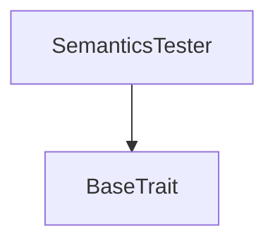
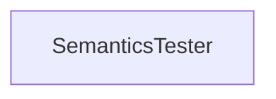

# Tact compilation report

Contract: SemanticsTester
BoC Size: 16749 bytes

## Structures (Structs and Messages)

Total structures: 12

### DataSize

TL-B: `_ cells:int257 bits:int257 refs:int257 = DataSize`
Signature: `DataSize{cells:int257,bits:int257,refs:int257}`

### StateInit

TL-B: `_ code:^cell data:^cell = StateInit`
Signature: `StateInit{code:^cell,data:^cell}`

### Context

TL-B: `_ bounceable:bool sender:address value:int257 raw:^slice = Context`
Signature: `Context{bounceable:bool,sender:address,value:int257,raw:^slice}`

### SendParameters

TL-B: `_ mode:int257 body:Maybe ^cell code:Maybe ^cell data:Maybe ^cell value:int257 to:address bounce:bool = SendParameters`
Signature: `SendParameters{mode:int257,body:Maybe ^cell,code:Maybe ^cell,data:Maybe ^cell,value:int257,to:address,bounce:bool}`

### DeployParameters

TL-B: `_ mode:int257 body:Maybe ^cell value:int257 bounce:bool init:StateInit{code:^cell,data:^cell} = DeployParameters`
Signature: `DeployParameters{mode:int257,body:Maybe ^cell,value:int257,bounce:bool,init:StateInit{code:^cell,data:^cell}}`

### StdAddress

TL-B: `_ workchain:int8 address:uint256 = StdAddress`
Signature: `StdAddress{workchain:int8,address:uint256}`

### VarAddress

TL-B: `_ workchain:int32 address:^slice = VarAddress`
Signature: `VarAddress{workchain:int32,address:^slice}`

### SA

TL-B: `_ a1:int257 a2:SB{b1:bool,b2:SC{c1:int257},b3:int257} = SA`
Signature: `SA{a1:int257,a2:SB{b1:bool,b2:SC{c1:int257},b3:int257}}`

### SB

TL-B: `_ b1:bool b2:SC{c1:int257} b3:int257 = SB`
Signature: `SB{b1:bool,b2:SC{c1:int257},b3:int257}`

### SC

TL-B: `_ c1:int257 = SC`
Signature: `SC{c1:int257}`

### MapWrapper

TL-B: `_ m:dict<int, ^SA{a1:int257,a2:SB{b1:bool,b2:SC{c1:int257},b3:int257}}> = MapWrapper`
Signature: `MapWrapper{m:dict<int, ^SA{a1:int257,a2:SB{b1:bool,b2:SC{c1:int257},b3:int257}}>}`

### SemanticsTester$Data

TL-B: `null`
Signature: `null`

## Get methods

Total get methods: 52

## checkAllContractFieldsAreUnchanged

No arguments

## structAssign1

No arguments

## structAssign2

No arguments

## paramStruct1

No arguments

## paramStruct2

No arguments

## mutateParamStruct1

No arguments

## mutateParamStruct2

No arguments

## testReturnedStructs

No arguments

## mutatesChainStruct1

No arguments

## mutatesChainStruct2

No arguments

## mutatesChainStruct3

No arguments

## mutatesChainStruct4

No arguments

## mutatesChainStruct5

No arguments

## mutatesChainStruct6

No arguments

## mapAssign1

No arguments

## mapAssign2

No arguments

## paramMap1

No arguments

## paramMap2

No arguments

## mutateParamMap1

No arguments

## mutateParamMap2

No arguments

## testReturnedMaps1

No arguments

## mutateNestedMap1

No arguments

## contractAssign1

No arguments

## contractAssign2

No arguments

## paramContract

No arguments

## mutateParamContract

No arguments

## address

No arguments

## testReturnedContracts

No arguments

## mutateContractStateFlag

No arguments

## changesPersisted

No arguments

## mutatesChainInt1

No arguments

## mutatesChainInt2

No arguments

## mutatesChainInt3

No arguments

## mutatesChainInt4

No arguments

## mutatesChainInt5

No arguments

## mutatesChainInt6

No arguments

## andMutateShortCircuit

No arguments

## andInfiniteLoopShortCircuit

No arguments

## andExceptionShortCircuit

No arguments

## orMutateShortCircuit

No arguments

## orInfiniteLoopShortCircuit

No arguments

## orExceptionShortCircuit

No arguments

## ternaryMutateShortCircuit

No arguments

## ternaryInfiniteLoopShortCircuit

No arguments

## ternaryExceptionShortCircuit

No arguments

## testAddressEquality

No arguments

## testInversesParseStdAddressAndNewAddress

No arguments

## testSliceEquality1

No arguments

## testSliceEquality2

No arguments

## testCellEquality1

No arguments

## testCellEquality2

No arguments

## testCellEquality3

No arguments

## Exit codes

- 2: Stack underflow
- 3: Stack overflow
- 4: Integer overflow
- 5: Integer out of expected range
- 6: Invalid opcode
- 7: Type check error
- 8: Cell overflow
- 9: Cell underflow
- 10: Dictionary error
- 11: 'Unknown' error
- 12: Fatal error
- 13: Out of gas error
- 14: Virtualization error
- 32: Action list is invalid
- 33: Action list is too long
- 34: Action is invalid or not supported
- 35: Invalid source address in outbound message
- 36: Invalid destination address in outbound message
- 37: Not enough Toncoin
- 38: Not enough extra currencies
- 39: Outbound message does not fit into a cell after rewriting
- 40: Cannot process a message
- 41: Library reference is null
- 42: Library change action error
- 43: Exceeded maximum number of cells in the library or the maximum depth of the Merkle tree
- 50: Account state size exceeded limits
- 128: Null reference exception
- 129: Invalid serialization prefix
- 130: Invalid incoming message
- 131: Constraints error
- 132: Access denied
- 133: Contract stopped
- 134: Invalid argument
- 135: Code of a contract was not found
- 136: Invalid standard address

## Trait inheritance diagram

## Contract dependency diagram

