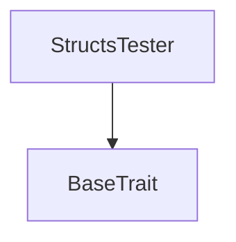
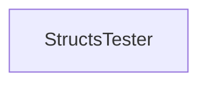

# Tact compilation report

Contract: StructsTester
BoC Size: 9410 bytes

## Structures (Structs and Messages)

Total structures: 33

### DataSize

TL-B: `_ cells:int257 bits:int257 refs:int257 = DataSize`
Signature: `DataSize{cells:int257,bits:int257,refs:int257}`

### StateInit

TL-B: `_ code:^cell data:^cell = StateInit`
Signature: `StateInit{code:^cell,data:^cell}`

### Context

TL-B: `_ bounceable:bool sender:address value:int257 raw:^slice = Context`
Signature: `Context{bounceable:bool,sender:address,value:int257,raw:^slice}`

### SendParameters

TL-B: `_ mode:int257 body:Maybe ^cell code:Maybe ^cell data:Maybe ^cell value:int257 to:address bounce:bool = SendParameters`
Signature: `SendParameters{mode:int257,body:Maybe ^cell,code:Maybe ^cell,data:Maybe ^cell,value:int257,to:address,bounce:bool}`

### DeployParameters

TL-B: `_ mode:int257 body:Maybe ^cell value:int257 bounce:bool init:StateInit{code:^cell,data:^cell} = DeployParameters`
Signature: `DeployParameters{mode:int257,body:Maybe ^cell,value:int257,bounce:bool,init:StateInit{code:^cell,data:^cell}}`

### StdAddress

TL-B: `_ workchain:int8 address:uint256 = StdAddress`
Signature: `StdAddress{workchain:int8,address:uint256}`

### VarAddress

TL-B: `_ workchain:int32 address:^slice = VarAddress`
Signature: `VarAddress{workchain:int32,address:^slice}`

### S

TL-B: `_ a:bool b:int257 = S`
Signature: `S{a:bool,b:int257}`

### T

TL-B: `_ a:int257 s:S{a:bool,b:int257} = T`
Signature: `T{a:int257,s:S{a:bool,b:int257}}`

### MyStruct1

TL-B: `_ a:int257 b:uint32 c:Maybe int257 = MyStruct1`
Signature: `MyStruct1{a:int257,b:uint32,c:Maybe int257}`

### MyStruct2

TL-B: `_ m:dict<int, uint64> s:Maybe MyStruct1{a:int257,b:uint32,c:Maybe int257} = MyStruct2`
Signature: `MyStruct2{m:dict<int, uint64>,s:Maybe MyStruct1{a:int257,b:uint32,c:Maybe int257}}`

### MyStruct3

TL-B: `_ s:^string = MyStruct3`
Signature: `MyStruct3{s:^string}`

### MyMessage1

TL-B: `my_message1#a98a916c a:int257 s:MyStruct2{m:dict<int, uint64>,s:Maybe MyStruct1{a:int257,b:uint32,c:Maybe int257}} = MyMessage1`
Signature: `MyMessage1{a:int257,s:MyStruct2{m:dict<int, uint64>,s:Maybe MyStruct1{a:int257,b:uint32,c:Maybe int257}}}`

### Coin

TL-B: `_ first:coins second:uint32 = Coin`
Signature: `Coin{first:coins,second:uint32}`

### VarIntegers

TL-B: `_ a:varint16 b:varint32 c:varuint16 d:varuint32 = VarIntegers`
Signature: `VarIntegers{a:varint16,b:varint32,c:varuint16,d:varuint32}`

### IntFields

TL-B: `_ i1:int1 i2:int2 i3:int3 i255:int255 i256:int256 i257:int257 = IntFields`
Signature: `IntFields{i1:int1,i2:int2,i3:int3,i255:int255,i256:int256,i257:int257}`

### UintFields

TL-B: `uint_fields#ea01f46a u1:uint1 u2:uint2 u3:uint3 u254:uint254 u255:uint255 u256:uint256 = UintFields`
Signature: `UintFields{u1:uint1,u2:uint2,u3:uint3,u254:uint254,u255:uint255,u256:uint256}`

### LongStruct15

TL-B: `_ x1:int257 x2:int257 x3:int257 x4:int257 x5:int257 x6:int257 x7:int257 x8:int257 x9:int257 x10:int257 x11:int257 x12:int257 x13:int257 x14:int257 x15:int257 = LongStruct15`
Signature: `LongStruct15{x1:int257,x2:int257,x3:int257,x4:int257,x5:int257,x6:int257,x7:int257,x8:int257,x9:int257,x10:int257,x11:int257,x12:int257,x13:int257,x14:int257,x15:int257}`

### LongStruct16

TL-B: `_ x1:int257 x2:int257 x3:int257 x4:int257 x5:int257 x6:int257 x7:int257 x8:int257 x9:int257 x10:int257 x11:int257 x12:int257 x13:int257 x14:int257 x15:int257 x16:int257 = LongStruct16`
Signature: `LongStruct16{x1:int257,x2:int257,x3:int257,x4:int257,x5:int257,x6:int257,x7:int257,x8:int257,x9:int257,x10:int257,x11:int257,x12:int257,x13:int257,x14:int257,x15:int257,x16:int257}`

### LongStruct32

TL-B: `_ x1:int257 x2:int257 x3:int257 x4:int257 x5:int257 x6:int257 x7:int257 x8:int257 x9:int257 x10:int257 x11:int257 x12:int257 x13:int257 x14:int257 x15:int257 x16:int257 x17:int257 x18:int257 x19:int257 x20:int257 x21:int257 x22:int257 x23:int257 x24:int257 x25:int257 x26:int257 x27:int257 x28:int257 x29:int257 x30:int257 x31:int257 x32:int257 = LongStruct32`
Signature: `LongStruct32{x1:int257,x2:int257,x3:int257,x4:int257,x5:int257,x6:int257,x7:int257,x8:int257,x9:int257,x10:int257,x11:int257,x12:int257,x13:int257,x14:int257,x15:int257,x16:int257,x17:int257,x18:int257,x19:int257,x20:int257,x21:int257,x22:int257,x23:int257,x24:int257,x25:int257,x26:int257,x27:int257,x28:int257,x29:int257,x30:int257,x31:int257,x32:int257}`

### LongNestedStruct

TL-B: `_ x1:int257 x2:int257 x3:int257 x4:int257 x5:int257 x6:int257 x7:int257 x8:int257 x9:int257 x10:int257 x11:int257 x12:int257 x13:int257 x14:int257 x15:int257 x16:int257 x17:int257 x18:int257 x19:int257 x20:int257 s1:LongStruct15{x1:int257,x2:int257,x3:int257,x4:int257,x5:int257,x6:int257,x7:int257,x8:int257,x9:int257,x10:int257,x11:int257,x12:int257,x13:int257,x14:int257,x15:int257} s2:LongStruct16{x1:int257,x2:int257,x3:int257,x4:int257,x5:int257,x6:int257,x7:int257,x8:int257,x9:int257,x10:int257,x11:int257,x12:int257,x13:int257,x14:int257,x15:int257,x16:int257} s3:LongStruct32{x1:int257,x2:int257,x3:int257,x4:int257,x5:int257,x6:int257,x7:int257,x8:int257,x9:int257,x10:int257,x11:int257,x12:int257,x13:int257,x14:int257,x15:int257,x16:int257,x17:int257,x18:int257,x19:int257,x20:int257,x21:int257,x22:int257,x23:int257,x24:int257,x25:int257,x26:int257,x27:int257,x28:int257,x29:int257,x30:int257,x31:int257,x32:int257} = LongNestedStruct`
Signature: `LongNestedStruct{x1:int257,x2:int257,x3:int257,x4:int257,x5:int257,x6:int257,x7:int257,x8:int257,x9:int257,x10:int257,x11:int257,x12:int257,x13:int257,x14:int257,x15:int257,x16:int257,x17:int257,x18:int257,x19:int257,x20:int257,s1:LongStruct15{x1:int257,x2:int257,x3:int257,x4:int257,x5:int257,x6:int257,x7:int257,x8:int257,x9:int257,x10:int257,x11:int257,x12:int257,x13:int257,x14:int257,x15:int257},s2:LongStruct16{x1:int257,x2:int257,x3:int257,x4:int257,x5:int257,x6:int257,x7:int257,x8:int257,x9:int257,x10:int257,x11:int257,x12:int257,x13:int257,x14:int257,x15:int257,x16:int257},s3:LongStruct32{x1:int257,x2:int257,x3:int257,x4:int257,x5:int257,x6:int257,x7:int257,x8:int257,x9:int257,x10:int257,x11:int257,x12:int257,x13:int257,x14:int257,x15:int257,x16:int257,x17:int257,x18:int257,x19:int257,x20:int257,x21:int257,x22:int257,x23:int257,x24:int257,x25:int257,x26:int257,x27:int257,x28:int257,x29:int257,x30:int257,x31:int257,x32:int257}}`

### LongNestedStructWithOpts

TL-B: `_ x1:int257 x2:int257 x3:int257 x4:int257 x5:int257 x6:int257 x7:int257 x8:int257 x9:int257 x10:int257 x11:int257 x12:int257 x13:int257 x14:int257 x15:int257 x16:int257 x17:int257 x18:Maybe int257 x19:int257 x20:int257 s1:Maybe LongStruct15{x1:int257,x2:int257,x3:int257,x4:int257,x5:int257,x6:int257,x7:int257,x8:int257,x9:int257,x10:int257,x11:int257,x12:int257,x13:int257,x14:int257,x15:int257} s2:LongStruct16{x1:int257,x2:int257,x3:int257,x4:int257,x5:int257,x6:int257,x7:int257,x8:int257,x9:int257,x10:int257,x11:int257,x12:int257,x13:int257,x14:int257,x15:int257,x16:int257} s3:Maybe LongStruct32{x1:int257,x2:int257,x3:int257,x4:int257,x5:int257,x6:int257,x7:int257,x8:int257,x9:int257,x10:int257,x11:int257,x12:int257,x13:int257,x14:int257,x15:int257,x16:int257,x17:int257,x18:int257,x19:int257,x20:int257,x21:int257,x22:int257,x23:int257,x24:int257,x25:int257,x26:int257,x27:int257,x28:int257,x29:int257,x30:int257,x31:int257,x32:int257} = LongNestedStructWithOpts`
Signature: `LongNestedStructWithOpts{x1:int257,x2:int257,x3:int257,x4:int257,x5:int257,x6:int257,x7:int257,x8:int257,x9:int257,x10:int257,x11:int257,x12:int257,x13:int257,x14:int257,x15:int257,x16:int257,x17:int257,x18:Maybe int257,x19:int257,x20:int257,s1:Maybe LongStruct15{x1:int257,x2:int257,x3:int257,x4:int257,x5:int257,x6:int257,x7:int257,x8:int257,x9:int257,x10:int257,x11:int257,x12:int257,x13:int257,x14:int257,x15:int257},s2:LongStruct16{x1:int257,x2:int257,x3:int257,x4:int257,x5:int257,x6:int257,x7:int257,x8:int257,x9:int257,x10:int257,x11:int257,x12:int257,x13:int257,x14:int257,x15:int257,x16:int257},s3:Maybe LongStruct32{x1:int257,x2:int257,x3:int257,x4:int257,x5:int257,x6:int257,x7:int257,x8:int257,x9:int257,x10:int257,x11:int257,x12:int257,x13:int257,x14:int257,x15:int257,x16:int257,x17:int257,x18:int257,x19:int257,x20:int257,x21:int257,x22:int257,x23:int257,x24:int257,x25:int257,x26:int257,x27:int257,x28:int257,x29:int257,x30:int257,x31:int257,x32:int257}}`

### Point

TL-B: `_ x:int64 y:int64 = Point`
Signature: `Point{x:int64,y:int64}`

### Line

TL-B: `_ start:Point{x:int64,y:int64} end:Point{x:int64,y:int64} = Line`
Signature: `Line{start:Point{x:int64,y:int64},end:Point{x:int64,y:int64}}`

### Location

TL-B: `_ idx:int257 line1:Line{start:Point{x:int64,y:int64},end:Point{x:int64,y:int64}} line2:Maybe Line{start:Point{x:int64,y:int64},end:Point{x:int64,y:int64}} = Location`
Signature: `Location{idx:int257,line1:Line{start:Point{x:int64,y:int64},end:Point{x:int64,y:int64}},line2:Maybe Line{start:Point{x:int64,y:int64},end:Point{x:int64,y:int64}}}`

### DoubleNestedStructOpt

TL-B: `_ a:int257 s:Maybe MyStruct1{a:int257,b:uint32,c:Maybe int257} = DoubleNestedStructOpt`
Signature: `DoubleNestedStructOpt{a:int257,s:Maybe MyStruct1{a:int257,b:uint32,c:Maybe int257}}`

### TripleNestedStructOpt

TL-B: `_ a:int257 s:Maybe DoubleNestedStructOpt{a:int257,s:Maybe MyStruct1{a:int257,b:uint32,c:Maybe int257}} = TripleNestedStructOpt`
Signature: `TripleNestedStructOpt{a:int257,s:Maybe DoubleNestedStructOpt{a:int257,s:Maybe MyStruct1{a:int257,b:uint32,c:Maybe int257}}}`

### LongAndDeepNestedStruct

TL-B: `_ x1:int257 x2:int257 x3:int257 x4:int257 x5:int257 x6:int257 x7:int257 x8:int257 x9:int257 x10:int257 x11:int257 x12:int257 x13:int257 x14:int257 x15:int257 x16:int257 s1:TripleNestedStructOpt{a:int257,s:Maybe DoubleNestedStructOpt{a:int257,s:Maybe MyStruct1{a:int257,b:uint32,c:Maybe int257}}} s2:TripleNestedStructOpt{a:int257,s:Maybe DoubleNestedStructOpt{a:int257,s:Maybe MyStruct1{a:int257,b:uint32,c:Maybe int257}}} s3:Maybe TripleNestedStructOpt{a:int257,s:Maybe DoubleNestedStructOpt{a:int257,s:Maybe MyStruct1{a:int257,b:uint32,c:Maybe int257}}} s4:Maybe TripleNestedStructOpt{a:int257,s:Maybe DoubleNestedStructOpt{a:int257,s:Maybe MyStruct1{a:int257,b:uint32,c:Maybe int257}}} = LongAndDeepNestedStruct`
Signature: `LongAndDeepNestedStruct{x1:int257,x2:int257,x3:int257,x4:int257,x5:int257,x6:int257,x7:int257,x8:int257,x9:int257,x10:int257,x11:int257,x12:int257,x13:int257,x14:int257,x15:int257,x16:int257,s1:TripleNestedStructOpt{a:int257,s:Maybe DoubleNestedStructOpt{a:int257,s:Maybe MyStruct1{a:int257,b:uint32,c:Maybe int257}}},s2:TripleNestedStructOpt{a:int257,s:Maybe DoubleNestedStructOpt{a:int257,s:Maybe MyStruct1{a:int257,b:uint32,c:Maybe int257}}},s3:Maybe TripleNestedStructOpt{a:int257,s:Maybe DoubleNestedStructOpt{a:int257,s:Maybe MyStruct1{a:int257,b:uint32,c:Maybe int257}}},s4:Maybe TripleNestedStructOpt{a:int257,s:Maybe DoubleNestedStructOpt{a:int257,s:Maybe MyStruct1{a:int257,b:uint32,c:Maybe int257}}}}`

### Foo

TL-B: `foo#0000002a s:remainder<slice> = Foo`
Signature: `Foo{s:remainder<slice>}`

### Dict

TL-B: `_ m:dict<uint8, coins> = Dict`
Signature: `Dict{m:dict<uint8, coins>}`

### OptionalFields

TL-B: `_ nickname:Maybe ^string avatar:Maybe ^string = OptionalFields`
Signature: `OptionalFields{nickname:Maybe ^string,avatar:Maybe ^string}`

### S1

TL-B: `_ a:int257 b:int257 c:int257 = S1`
Signature: `S1{a:int257,b:int257,c:int257}`

### StructsTester$Data

TL-B: `null`
Signature: `null`

## Get methods

Total get methods: 55

## structInitializerTest

No arguments

## toCell1

Argument: s

## toSlice1

Argument: s

## fromCell1

Argument: src

## fromSlice1

Argument: src

## toCell2

Argument: s

## fromCell2

Argument: src

## fromSlice2

Argument: src

## test1

Argument: s1
Argument: s2

## toCellMessage1

Argument: m

## fromCellMessage1

Argument: src

## fromSliceMessage1

Argument: src

## contractStructConstantImmediate

No arguments

## globalConstStructConstantImmediate

No arguments

## contractStructConstantFieldImmediate

No arguments

## globalConstStructConstantFieldImmediate

No arguments

## contractStructConstantViaVar

No arguments

## globalConstStructConstantViaVar

No arguments

## contractStructConstantFieldViaVar

No arguments

## globalConstStructConstantFieldViaVar

No arguments

## longStruct15Test

No arguments

## longStruct16Test

No arguments

## longStruct32Test

No arguments

## longNestedStructTest

No arguments

## longNestedStructWithOptsTest

No arguments

## longContractTest

No arguments

## location1

No arguments

## location2

No arguments

## tripleNestedStructOpt1

No arguments

## tripleNestedStructOpt2

No arguments

## tripleNestedStructOpt3

No arguments

## longAndDeepNestedStruct1

No arguments

## longAndDeepNestedStruct2

No arguments

## longAndDeepNestedStruct3

No arguments

## intFieldsStruct

No arguments

## intFieldsFromCell

Argument: src

## uintFieldsMessage

No arguments

## uintFieldsFromCell

Argument: src

## optionalFields

No arguments

## destructuringTest1

No arguments

## destructuringTest1Const

No arguments

## destructuringTest2

No arguments

## destructuringTest2Const

No arguments

## destructuringTest3

No arguments

## destructuringTest3Const

No arguments

## destructuringTest4

No arguments

## destructuringTest4Const

No arguments

## destructuringTest5

No arguments

## destructuringTest5Const

No arguments

## destructuringTest6

No arguments

## destructuringTest6Const

No arguments

## destructuringTest7

No arguments

## destructuringTest7Const

No arguments

## destructuringTest8

No arguments

## destructuringTest8Const

No arguments

## Exit codes

- 2: Stack underflow
- 3: Stack overflow
- 4: Integer overflow
- 5: Integer out of expected range
- 6: Invalid opcode
- 7: Type check error
- 8: Cell overflow
- 9: Cell underflow
- 10: Dictionary error
- 11: 'Unknown' error
- 12: Fatal error
- 13: Out of gas error
- 14: Virtualization error
- 32: Action list is invalid
- 33: Action list is too long
- 34: Action is invalid or not supported
- 35: Invalid source address in outbound message
- 36: Invalid destination address in outbound message
- 37: Not enough Toncoin
- 38: Not enough extra currencies
- 39: Outbound message does not fit into a cell after rewriting
- 40: Cannot process a message
- 41: Library reference is null
- 42: Library change action error
- 43: Exceeded maximum number of cells in the library or the maximum depth of the Merkle tree
- 50: Account state size exceeded limits
- 128: Null reference exception
- 129: Invalid serialization prefix
- 130: Invalid incoming message
- 131: Constraints error
- 132: Access denied
- 133: Contract stopped
- 134: Invalid argument
- 135: Code of a contract was not found
- 136: Invalid standard address

## Trait inheritance diagram

## Contract dependency diagram

